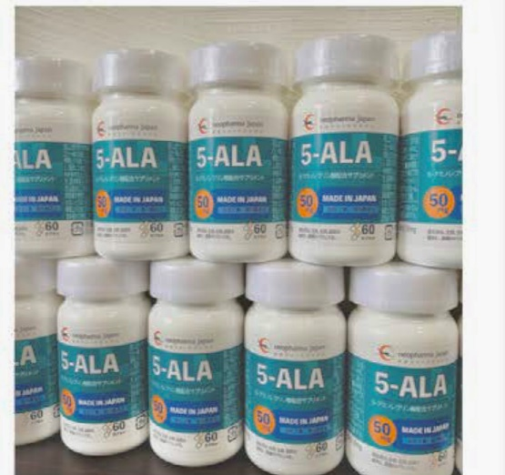
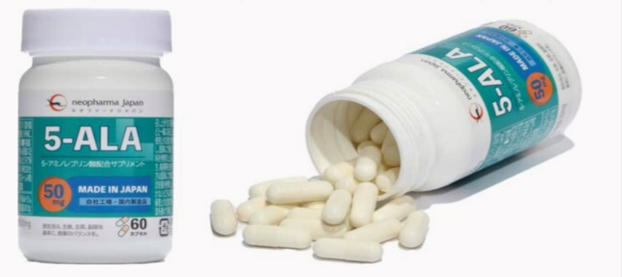
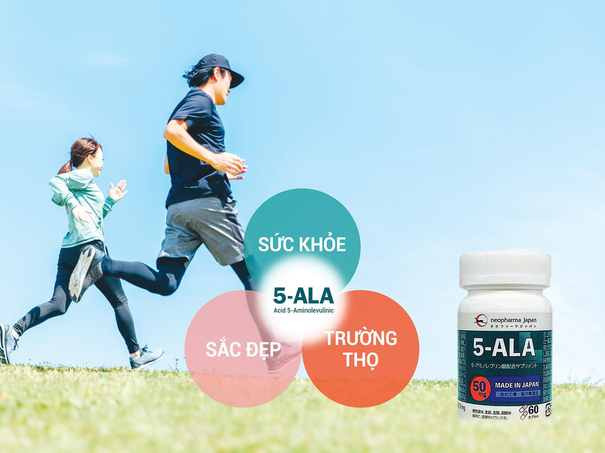
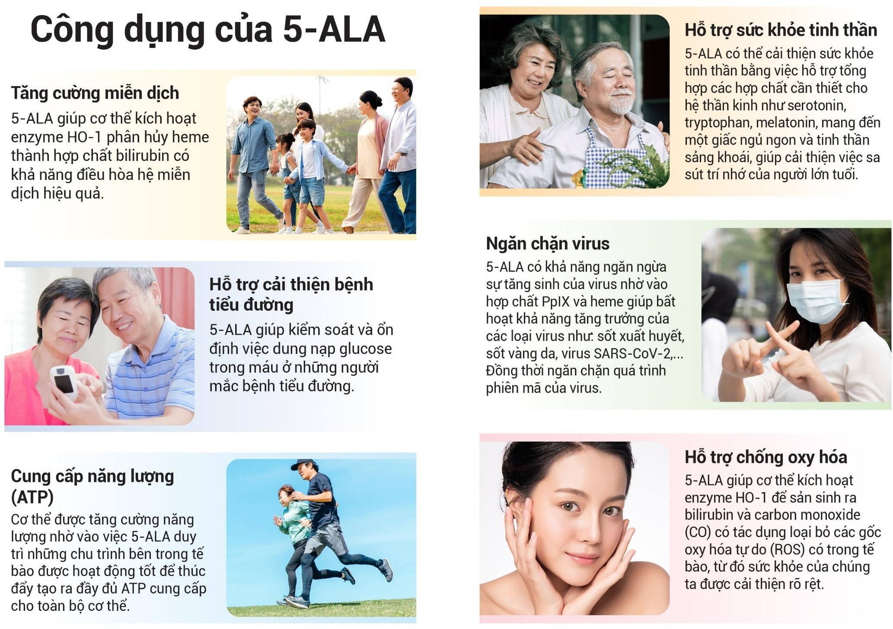
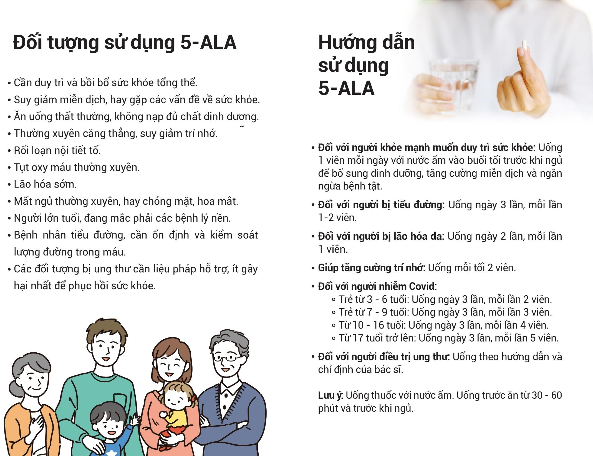

<!-- Slide number: 1 -->
BẢNG BÁO GIÁ SẢN PHẨM
(Giải pháp giữ trọn Thanh Xuân)
Trước tiên, Công Ty Cổ phần Capital Seaweed Consumer Việt Nam xin gửi lời cảm ơn chân thành đến Quý khách hàng đã quan tâm và tin tưởng các sản phẩm của chúng tôi. Chúng tôi xin trân trọng giới thiệu bảng giá chi tiết cho các sản phẩm chăm sóc sức khỏe và sắc đẹp như sau:

|  |  |  |  |  |  |  |  |  |  |
| --- | --- | --- | --- | --- | --- | --- | --- | --- | --- |
| MÃ SP | NHÀ SẢN XUẤT | TÊN SẢN PHẨM | HÌNH ẢNH SẢN PHẨM | QUY CÁCH | MOQ |  | Giá bán VNĐ (+8% VAT) | Tồng đơn hàng (VNĐ) | Ghi chú |
|  |  |  |  |  | Đơn vị | Số lượng |  |  |  |
| Neo01 | Neo Pharma JP | Axit 5-Aminolevulinic (5-ALA) |  | 60 viên/ Bottle | Bottle | 1 | 1,300,000 | 1,300,000 | Thanh toán trước khi nhận hàng & Ship hàng toàn quốc |
|  |  |  |  |  |  | 5 | 4,250,000 | 21,250,000 |  |
|  |  |  |  |  |  | 10 | 7,500,000 | 75,000,000 |  |

Mọi chi tiết xin vui lòng liên hệ
CÔNG TY CỔ PHẦN CAPITAL SEAWEED CONSUMER VIỆT NAM
Địa chỉ: Số 05 Đường CN13, Nhóm Công Nghiệp 1, Khu Công Nghiệp Tân Bình, phường Tây Thạnh, Tp. Hồ Chí Minh, Việt Nam.
Điện thoại: 0283 816 1769 - Hotline: 0903 894 200 (Zalo/ Viber/ WhatsApp)
Website: www.cscshop.vn - Email: support@csc-vn.com
Tài khoản thanh toán:
Số tài khoản: 441000661465
Ngân hàng: TMCP Ngoại Thương Việt Nam - Chi Nhánh Tân Bình

<!-- Slide number: 2 -->
Chúng tôi cam kết đảm bảo chất lượng và nguồn gốc của sản phẩm. Quý Khách có thể tham khảo thông tin chi tiết về từng sản phẩm, tài liệu khoa học, chứng từ - chứng nhận, cách sử dụng và giá cả trên website www.cscshop.vn của chúng tôi, hoặc liên hệ trực tiếp với đội ngũ KINH DOANH CỦA CSgroup để biết thêm thông tin.

| ĐỘI NGŨ KINH DOANH |  |  |
| --- | --- | --- |
| Mr Đinh Tuấn Nam | 038 752 5924 | đinhtuannam@csc-vn.com |
| Mrs Nguyễn Thị Thủy | 090 937 4711 | nguyenthithuy@csc-vn.com |
| Ms. Từ Yến Anh | 093 218 5116 | tuyenanh@csc-vn.com |
| Ms. Lâm Thảo Vi | 089 846 7758 | lamthaovi@csc-vn.com |
Chúng tôi luôn chăm chỉ làm việc để hỗ trợ Quý Khách Hàng tạo nên một cuộc sống lành mạnh, trẻ đẹp và tràn đầy năng lượng. Chúng tôi mong muốn mang “SỨC KHỎE - SẮC ĐẸP - TRƯỜNG THỌ” đến cho tất cả Quý Khách Hàng.

5-ALA
(Neopharma, Japan)
Hỗ trợ điều trị Tiểu đường, duy trì & bồi bổ sức khỏe tổng thể!

<!-- Slide number: 3 -->

<!-- Slide number: 4 -->

<!-- Slide number: 5 -->

Axit 5-Aminolevulinic (5-ALA)
(Yu Shimura)
Viện nghiên cứu Di truyền của Người, Helmholtz Zentrum, Munchen, Munich, CHLB Đức
Khoa nghiên cứu Sự chuyển hóa, Trung tâm Y tế Di truyền, Bệnh viện Trẻ em Chiba
Diễn đàn Nghiên cứu Các bệnh Ti thể của Người lần thứ 5, ngày 23 tháng 01 năm 2021, 11h00 – 16h10

<!-- Slide number: 6 -->

Nội Dung Chính
1. Axit 5-Aminolevulinic Axit (5-ALA) là gì?
	- Một số khái niệm cơ bản về 5-ALA
	- Ứng dụng 5-ALA trong Y Dược
2. Tác dụng của 5-ALA đối với những bệnh ty thể
3. Thử nghiệm lâm sàng trên bệnh não Leigh dưới sự hướng dẫn của bác sĩ

<!-- Slide number: 7 -->
PHẦN 1 - Axit 5-Aminolevulinic Axit (5-ALA) là gì?
Một số khái niệm cơ bản về 5-ALA
Ứng dụng 5-ALA trong Y Dược

<!-- Slide number: 8 -->
ALA là gì? – Tại sao ALA được xem là nguồn gốc sự sống

Axit 5-Aminolevulinic được gọi tắt là 5-ALA
ALA được tổng hợp trên Trái đất nguyên thủy 3,6 tỷ năm trước;
Amino axit tự nhiên được gọi là “nguồn gốc của sự sống”
Không phải là một dạng protein
Thiết yếu cho sự tổng hợp Hemoglobin (nền tảng của máu)
Vô cùng quan trọng trong quá trình tạo ra năng lượng của tế bào

ALA được tìm thấy lần đầu tiên trong cơ thể người; nó là một thành tố quan trọng của máu và chất diệp lục
Hơn 500 loại axit amin
20 loại
Không tổng hợp protein, nhưng có các tính năng đặc biệt
Tổng hợp protein
9 loại axit amin thiết yếu
11 loại axit amin không thiết yếu
9 loại
5-ALA, taurine, ornithine, citrulline, GABA, DOPA, v.v…
Cơ thể người có khả năng tự tổng hợp
Cơ thể người không thể tự tổng hợp
Glycine, serine, glutamine, glutamic acid, lorin, tyrosine, cysteine, alanine, aspartic acid, arginine, v.v…
Valine, leucine, inleucine, lysine, thionine, phenalalanine, threonine, lyptophan, histidine, v.v…

<!-- Slide number: 9 -->
ALA là gì? – Tại sao ALA được xem là nguồn gốc sự sống (t.t.)

ALA là một nguyên liệu nền tảng với nhiều chức năng khác nhau trong cơ thể;
Từ ALA, nhiều vật liệu quan trọng khác được tổng hợp cho sự hoạt động của cơ thể
Catalase
Tương tác và hóa giải các gốc tự do
Vitamin B12
Động vật
Hemoglobin
Heme
Cytochrome
Tổng hợp ATP
P450, Chức năng gan, giải độc
Thực vật
Diệp lục
SỰ KẾT HỢP VÔ CÙNG QUAN TRỌNG GIỮA ALA VÀ CÁC KHOÁNG CHẤT

<!-- Slide number: 10 -->

Mối Liên Hệ Giữa Heme Và Ty Thể Trong Tế Bào?
Heme tham gia trực tiếp vào chuỗi hô hấp ty thể II, III, IV và phức hợp Cytochrome (Cyt c)
Tế bào
Ty Thể
Glycine
Succinyl-CoA
Heme
Chuỗi hô hấp ty thể
*Ghi chú:
CI = Phức hợp I
CII = Phức hợp II
CIII = Phức hợp III
CIV = Phức hợp IV
CV = Phức hợp V
Heme
Heme
Heme

<!-- Slide number: 11 -->

Chuyển Hóa 5-ALA Trong Cơ Thể
5-ALA được tổng hợp mới 600mg/ngày
Cơ thể
Đào thải qua đường tiểu
Thức ăn
1mg trong quá trình tạo máu
1-2mg/ngày
Trữ lượng 5-ALA
     Hemoglobin       60g
     Heme Enzyme     8g
Đào thải qua Bilirubin

<!-- Slide number: 12 -->

Sự Lão Hóa Và ALA
Tuổi càng cao thì khả năng tự tổng hợp ALA càng giảm dần
Khả năng tự tổng hợp ALA trong cơ thể của sinh vật giảm dần theo tuổi tác
Những hoạt động của COX cần thiết cho quá trình hô hấp oxy (phức hợp IV) cũng giảm dần theo tuổi
Hoạt động COX (nmol/phút/mg protein)
nmol ALA được tổng hợp/giờ/gram protein
Hoạt động của Cytochrome c Oxydase trong Nguyên bào sợi
Lượng ALA được sản xuất**
Gan
Tim
Não
Trung bình ± sai số chuẩn trong 3 mẫu của 6 động vật
Tuổi của Chuột (tháng)
Tuổi của đối tượng cho mẫu (năm)
Heme cũng bị thiếu hụt dần vì ALA, yếu tố xác định cường độ tổng hợp heme, bị suy giảm dần.

<!-- Slide number: 13 -->

Triệu Chứng Học Của Sự Lão Hóa Do Thiếu Hụt Heme
Sự thiếu hụt Heme là một trong những nguyên nhân gây ra lão hóa

Những triệu chứng của việc thiếu hụt heme tương tự như sự lão hóa ở người

<!-- Slide number: 14 -->

Chuyển Hóa Glucose Bất Thường Do Thiếu ALA
Thiếu hụt ALA gây ra chuyển hóa glucose bất thường phụ thuộc vào tuổi
Thử nghiệm dung nạp glucose trên chuột với khả năng tổng hợp ALA đã bị giảm (mất dị hợp tử ALAS1)
Chuột từ 18 – 35 tuần tuổi
Chuột từ 8 – 12 tuần tuổi
Đường huyết (mg/dL)
Đường huyết (mg/dL)
Thời gian sau khi tiêm glucose (phút)
Thời gian sau khi tiêm glucose (phút)
ALA và sự mất điều hòa heme có thể đóng vai trò nhất định trong kiểm soát chuyển hóa glucose

<!-- Slide number: 15 -->

Chu Trình Hấp Thụ ALA Qua Đường Miệng
5-ALA ngoại sinh
ALA qua đường miệng được hấp thụ gần như hoàn toàn qua ống tiêu hóa phía trên.
ALA được phân bổ khắp cơ thể và đi qua hàng rào máu - não
Được tích hợp vào trong tế bào bởi chất vận chuyển peptit như là PEP-T1;
Hiếm khi được đưa đến ty thể thông qua con đường chuyển hóa Porphyrin.
Tế bào
5-ALA
ngoại sinh / nội sinh
*Ghi chú: Đối với Heme ngoại sinh, sau khi hấp thụ vào cơ thể sẽ kích hoạt phản ứng khử enzyme và bắt đầu quá trình phân hủy.
Heme
Glycine
5-ALA ngoại sinh
Succinyl- CoA
Ty thể
ALAS: Aminolevulinic acid synthase

<!-- Slide number: 16 -->

Tác dụng của việc bổ sung ALA
Hàm lượng Heme tăng lên sau khi bổ sung ALA và sắt
Thí nghiệm bổ sung 0,1 mM 5-ALA và Fe cho tế bào động mạch phổi từ bò
*Ghi chú: Tế bào động mạch phổi từ bò được nuôi cấy và phát triển với mỗi chất trên ở nhiệt độ 37 độ C.
*Ghi chú: Khi heme được tiêm một cách trực tiếp sẽ kích hoạt phản ứng khử enzyme và bắt đầu quá trình phân hủy.

<!-- Slide number: 17 -->
Tác dụng của việc bổ sung ALA – Cải thiện hoạt động của ty thể

Bổ sung ALA và sắt tăng cường hoạt động Phức hợp IV và sản xuất ATP
Thí nghiệm bổ sung 5-ALA qua đường miệng trên chuột trong 15 tuần (10 mg / kg)
Sản xuất ATP trong gan
Hoạt động của Phức hợp IV trong gan
Nồng độ ATP [10-8 mol g-tissue-1]
Hoạt động Cytochrome c oxidase
[đơn vị / mg-protein]
Kiểm soát                  ALA
Kiểm soát                  ALA

<!-- Slide number: 18 -->

Tác dụng của việc bổ sung ALA – Cải thiện trao đổi glucose
Bổ sung ALA phục hồi khả năng dung nạp glucose
và sự nhạy cảm với insulin
Thí nghiệm bổ sung ALA (300 mg / kg) qua đường miệng trên chuột đã bị giảm khả năng dung nạp glucose trong 01 tuần
Kiểm tra khả năng dung nạp glucose
Kiểm tra mức độ nhạy cảm với insulin
Đường máu (% cơ sở)
Kiểm soát
Bổ sung ALA
Đường máu (mg/dL)
Kiểm soát
Bổ sung ALA
Sau khi bổ sung ALA 1 tuần và dừng 1 tuần
Thời gian sau khi tiêm insulin (phút)
Thời gian sau khi nạp glucose (phút)
Đường máu sau bữa ăn và HbA1c ở người cũng được cải thiện sau khi bổ sung ALA

<!-- Slide number: 19 -->

Những tác dụng khác của việc bổ sung ALA
Trao đổi chất
Bệnh Alzheimer
* Duy trì chức năng vận hành của ty thể và hạn chế sự hình thành của peptide Amyloid Beta đối với bệnh Alzheimer.
* Với sự hỗ trợ của Phức hợp III, IV và V, cải thiện quá trình trao đổi chất béo và giảm cân
Bệnh Parkinson
Lão hóa / Vận động
* Thể hiện tác dụng bảo vệ hệ thần kinh trên chuột thí nghiệm mô hình bệnh Parkinson
	 (Hijioka M., et al (2020) J Pharmacol Sci 144:183-187
* Cải thiện hiệu quả của sự vận động / tập thể dục ở phụ nữ có tuổi.

<!-- Slide number: 20 -->
Chức Năng Bảo Về Tế Bào của HO-1 (heme oxygenase-1)

Những sản phẩm của quá trình phân giải Heme như Co và Bilirubin có tác dụng chống oxy hóa và chống viêm.
ALA / SFC kích hoạt biểu hiện HO-1
Tỷ lệ so sánh mức độ biểu hiện HO-1 giữa 0h và 8h
SFC: Sodium ferrous citrate
Stress Oxy hóa
Viêm

<!-- Slide number: 21 -->

Chức Năng Bảo Vệ Tế Bào của HO-1 (heme oxygenase-1) – Bệnh Miễn Dịch
5-ALA / SFC kiềm chế sự phát triển của vấn đề Xơ cứng bì phát sinh từ bệnh Ghép chống chủ (GVHD)
Tiêm 5-ALA / SFC cho chuột thí nghiệm mô hình bệnh Ghép chống chủ (GVHD)
*Bệnh Ghép chống chủ (GVHD) do truyền máu, trong miễn dịch học cấy ghép, được định nghĩa là sự tấn công lên những nội tạng bình thường bởi các tế bào miễn dịch từ mảnh ghép.
Tế bào được bổ sung 5-ALA
Biến đổi yếu tố tăng trưởng Beta (TGF-B) và những cytokine gây viêm được kiểm soát bởi sự kích hoạt của HO-1, qua đó kiềm chế chứng Xơ cứng bì do bệnh Ghép chống chủ (GVHD) gây ra.

<!-- Slide number: 22 -->

Tác Động Của 5-ALA Đối Với Các Bệnh Truyền Nhiễm
Ức chế sự phát triển của bệnh sốt rét
Kiềm chế sự truyền nhiễm của SARS-CoV-2
Công bố gửi đến báo chí và các tổ chức khoa học sức khỏe
Đại học Nagasaki kết hợp với Neopharma Japan
Ngày 29/10/2020

Để hỗ trợ bệnh nhân đã, đang và sẽ bị nhiễm COVID-19, Đại học Nagasaki công bố việc bắt đầu thử nghiệm điều trị lâm sàng sử dụng Axit 5-Aminolevulinic (5-ALA).
Trong những thí nghiệm trên tế bào, 5-ALA kìm hãm khả năng truyền nhiễm của SARS-CoV-2.
Trung tâm Nghiên cứu Lâm sàng sự truyền nhiễm COVID-19 ở người. Nghiên cứu đang được thực hiện.
* Tiêm bổ sung 5-ALA và SFC kích hoạt việc sản sinh các chất chuyển hóa trung gian và Heme. Những chất này sau đó tích tụ bên trong virút sốt rét và đẩy mạnh quá trình oxy hóa. Phương thức này sẽ cho phép kiểm soát bệnh sốt rét.

<!-- Slide number: 23 -->

Tác Động Của 5-ALA Trên Tế Bào Ung Thư Trong Chẩn Đoán & Điều Trị Bằng Liệu Pháp Quang Động
5-ALA ngoại sinh
Ứng dụng 5-ALA để chế ngự bệnh ung thư;
Chẩn đoán bằng liệu pháp quang động với ánh sáng huỳnh quang.
Ung thư tổ hợp nhỏ
(micro cancer)
Ung thư tổ hợp phẳng
(flat cancer)
Khối u liên kết
Tế bào Ung thư
Quan sát qua kính thông thường
Heme
Quan sát qua kính florescent chuyên dụng
* Bổ sung 5-ALA ngoại sinh tăng cường sản sinh PPIX trong tế bào.
* Thông qua việc đưa 5-ALA vào trong tế bào sẽ kích hoạt sự hình thành và tích lũy Protoporphyrin IX, một tiền tố của heme. Sau đó ứng dụng tính cảm quang để tạo ra gốc oxy hóa tự do bên trong tế bào ung thư và gây chết hoặc làm tổn thương tế bào này. Đây là một trong những liệu pháp quang động đã bắt đầu được áp dụng với kết quả khả thi.

<!-- Slide number: 24 -->

Tóm Tắt Những Tác Dụng Của 5-ALA
Tăng cường chuyển hóa glycolipid, ngăn chặn các bệnh thoái hóa thần kinh, kiểm soát những thay đổi do tuổi tác, kìm hãm bệnh ty thể, cải thiện chức năng các bộ phận cơ thể;
Bảo vệ tế bào thông qua kích hoạt HO-1;
Kìm hãm sự phát triển của bệnh Sốt rét và kiềm chế sự lây nhiễm của SARS-CoV-2;
Hiệu quả trong ứng dụng chẩn đoán và điều trị ung thư;
Đã được sử dụng rộng rãi như một loại thực phẩm bổ sung.

Những tác động của 5-ALA trên bệnh ty thể?

<!-- Slide number: 25 -->
PHẦN 2:
TÁC ĐỘNG CỦA 5-ALA TRÊN BỆNH TY THỂ

<!-- Slide number: 26 -->

Số Lượng Trường Hợp Được Yêu Cầu Xét Nghiệm Bệnh Ty Thể
Số lượng ca được yêu cầu kiểm tra vào khoảng 300 mỗi năm
Số lượng ca
Bệnh Viện Trẻ Em Chiba
Đại học Y Saitama
Tính đến 01/2021 có tổng cộng 2800 trường hợp đã được lấy mẫu xét nghiệm (tế bào, máu, nước tiểu…) và phân tích kết quả.

<!-- Slide number: 27 -->

Số Lượng Chẩn Đoán Sinh Hóa Của Bệnh Ty Thể
1159 dữ liệu và mẫu xét nghiệm đã được thu thập về thông tin lâm sàng, chẩn đoán sinh hóa và di truyền.
Số lượng ca
Mới
Cũ
Hơn 800 mẫu nguyên bào sợi ở da đã được thu thập và bảo quản

<!-- Slide number: 28 -->

Hồ Sơ Bệnh Nhân Có Bệnh Ty Thể Đã Được Lựa Chọn Để Nghiên Cứu
| STT | Định danh | Giới tính | Tuổi khởi phát | Chẩn đoán lâm sàng | Chẩn đoán Enzyme | Gene | Biến đổi gien |
| --- | --- | --- | --- | --- | --- | --- | --- |
5 tháng
1 năm
0 ngày
8 tháng
11 tháng
1 năm 11 tháng
0 ngày
9 tháng
*Ghi chú: IMD = Bệnh ty thể ở trẻ sơ sinh; LS = Bệnh não Leigh; ND = Bệnh thoái hóa thần kinh; MH = Bệnh ty thể tế bào gan
Tác động của 5-ALA trên chức năng ty thể đã được kiểm tra bằng việc xét nghiệm những nguyên bào sợi bình thường và 08 mẫu nguyên bào sợi có bệnh ty thể.
						(Shimura M et al., Sci Rep. 2019; 9:10549.)

<!-- Slide number: 29 -->

Phương Pháp Thí Nghiệm
ngày
ALA, SFC, ALA+SFC tổng hợp
2x104 tế bào
2x104 tế bào
(SFC: Sodium ferrous citrate)
Xét nghiệm
Đo lường ATP
Biểu hiện protein
Tiêu thụ Oxy (MRR)
Biểu hiện gene
Các mẫu xét nghiệm đã ghi nhận protein liên quan đến quá trình phosphoryl hóa oxy hóa, lượng oxy được tiêu thụ bởi ty thể, ATP được sản xuất, biểu hiện HO-1, và DNA ty thể.

<!-- Slide number: 30 -->

Tác Động Của 5-ALA Trên Nguyên Bào Sợi Ở Da Bình Thường – Biểu Hiện Protein
Tác động của ALA + SFC trên NDUFB8 (Phức hợp I), UQCRC2 (Phức hợp III), và biểu hiện của protein MTCO1 (Phức hợp IV)
(Phức hợp I)
(Phức hợp II)
(Phức hợp III)
(Phức hợp IV)
Beta-actin

<!-- Slide number: 31 -->

Tác Động Của 5-ALA Trên Nguyên Bào Sợi Ở Da Bình Thường – Biểu Hiện Protein
Biểu hiện các gien NDUFB8 (Phức hợp I), SDHB (Phức hợp II), UQCRC2 (Phức hợp III) và COX7A2 (Phức hợp IV) đều tăng lên dưới sự tác động của ALA + SFC và phụ thuộc vào nồng độ của tổ hợp này.
Biểu hiện tương đối
Biểu hiện tương đối
(Phức hợp II)
(Phức hợp I)
Biểu hiện tương đối
Biểu hiện tương đối
(Phức hợp III)
(Phức hợp IV)

<!-- Slide number: 32 -->
Tác Động Của 5-ALA Trên Nguyên Bào Sợi Ở Da Bình Thường – Tiêu Thụ Oxy

Mức độ tiêu thụ khí oxy đều tăng trong mọi điều kiện, nhiều nhất là dưới sự tác động của tổ hợp ALA + SFC
OCR (pmol/phút/2 x 104 tế bào)
Kiểm soát
Độ tiêu thụ oxy tối đa
OCR (pmol/phút/2 x 104 tế bào)
Thời gian (phút)
Kiểm soát
Thời gian (phút)
OCR (pmol/phút/2 x 104 tế bào)
Kiểm soát
Thời gian (phút)

<!-- Slide number: 33 -->

Tác Động Của 5-ALA Trên Nguyên Bào Sợi Trên Da – Mức Tiêu Thụ Oxy Và Sản Xuất ATP
Mức độ tiêu thụ khí oxy của ty thể và lượng ATP sản xuất đều tăng, đặc biệt là dưới tác động của tổ hợp ALA + SFC (200 / 100 µM)
Ảnh hưởng trên mức độ tiêu thụ khí oxy của ty thể ở tế bào bình thường (viết tắt MRR)
Ảnh hưởng trên khả năng sản xuất ATP của tế bào bình thường
MRR
(tỷ lệ % so với mẫu kiểm soát)
Sản lượng ATP
(tỷ lệ % so với mẫu kiểm soát)
MRR: maximum respiration rate = mức độ hô hấp tối đa
Mức độ tiêu thụ khí oxy và sản lượng ATP của tế bào đều tăng dưới tác động của ALA và SFC. Những ảnh hưởng này rõ ràng nhất ở hàm lượng ALA / SFC (200/100µM)
Sản lượng ATP của tế bào không tăng nhiều nếu như chỉ có sự tác động của SFC. Tuy nhiên, sản lượng này sẽ tăng rất nhiều dưới sự ảnh hưởng của tổ hợp ALA / SFC (200/100µM).
		Shimura M et al., Sci Rep. 2019; 9:10549

<!-- Slide number: 34 -->

Tác Động Của 5-ALA Trên Mẫu Tế Bào Từ Bệnh Nhân – Biểu Hiện Protein
ALA + SFC đồng thời thúc đẩy biểu hiện protein liên quan đến chuỗi hô hấp trên những tế bào mẫu thu được từ bệnh nhân.
Complex I = Phức hợp I
Complex II = Phức hợp II
Complex III = Phức hợp III
Complex IV = Phức hợp IV
β-Actin = Beta-actin
UQCRC2 (Phức hợp III), MTCO1 (Phức hợp IV) đều được cải thiện trong tất cả bệnh nhân (8/8). NDUFB8 (Phức hợp I) được cải thiện trong 5/8 trường hợp, và SDHB (Phức hợp II) được cải thiện trong 2/8 trường hợp. (Shimura M et al., Sci Rep. 2019; 9: 10549)

<!-- Slide number: 35 -->

Tác Động Của 5-ALA Trên Mẫu Tế Bào Từ Bệnh Nhân – Mức Độ Tiêu Thụ Oxy, Sản Lượng ATP
ALA + SFC cải thiện mức độ tiêu thụ khí oxy và sản lượng ATP trên mẫu tế bào từ các bệnh nhân
Mức độ hô hấp khí oxy tối đa
(tỷ lệ % so với mẫu kiểm soát)
* P < 0.05, ** P < 0.01 vs. Kiểm soát (thử nghiệm Dunnett)
Sản lượng ATP của tế bào
(tỷ lệ % so với mẫu kiểm soát)
Những mẫu tế bào được nuôi trong môi trường tổ hợp ALA + SFC cho thấy mức độ hô hấp oxy tối đa tăng đáng kể trên tất cả các mẫu. Sản lượng ATP được tăng cường đáng kể trong 7/8 mẫu tế bào. (Shimura M et al., Sci Rep. 2019; 9: 10549)

<!-- Slide number: 36 -->

Tác Động Của 5-ALA Trên Nguyên Bào Sợi Ở Da Bình Thường – Biểu Hiện HO-1
Biểu hiện HO-1 được cải thiện bởi tổ hợp ALA+SFC phụ thuộc vào nồng độ của tổ hợp này
Những sản phẩm của quá trình phân hủy Heme như CO, Bilirubin có tác dụng chống oxy hóa và chống viêm.
HO-1
(Biểu hiện tương đối)
Stress Oxy hóa
Viêm nhiễm
Biểu hiện HO-1 của nguyên bào sợi trên da bình thường được cải thiện dưới tác động của môi trường ALA + SFC.

<!-- Slide number: 37 -->
Tác Động Của 5-ALA Trên Mẫu Tế Bào Từ Bệnh Nhân – Biểu Hiện HO-1

Biểu hiện của protein HO-1 trong mẫu tế bào từ bệnh nhân được cải thiện dưới tác động của tổ hợp ALA + SFC.
Những cải thiện trong biểu hiện của protein HO-1 đã được xác nhận trên tất cả những mẫu tế bào từ bệnh nhân. Mức độ ảnh hưởng của tổ hợp ALA + SFC phụ thuộc rất nhiều vào nồng độ của tổ hợp này.

<!-- Slide number: 38 -->

Tác Động Của 5-ALA Trên Quá Trình Tổng Hợp Sinh Học Của Ty Thể
Tăng cường số lượng bản sao DNA ty thể trong mẫu tế bào từ bệnh nhân với tổ hợp ALA + SFC
Thay đổi trong số lượng bản sao DNA ty thể do tác động ALA + SFC
Tổng hợp sinh học của ty thể
Hình ảnh từ kính hiển vi
Tổ hợp ALA+SFC làm tăng số lượng bảo sao DNA ty thể từ 2.0 đến 3.5 lần so với mẫu tế bào kiểm soát lấy từ bệnh nhân.
Số lượng bản sao DNA ty thể đã tăng một cách đáng kể trong 5/8 mẫu tế bào lấy từ bệnh nhân.
Chuột
HO-1, CO là yếu tố phiên mã DNA ty thể tăng cường biểu hiện của PGC-1α, NRF1, TFAM và cải thiện quá trình tổng hợp sinh học của ty thể.

<!-- Slide number: 39 -->

Tóm tắt những tác động của tổ hợp 5-ALA + SFC trên các mẫu tế bào lấy từ bệnh nhân có bệnh ty thể
Cải thiện biểu hiện của các Phức hợp 1, 2, 3 và 4 trong ty thể của những mẫu tế bào lấy từ các bệnh nhân có bệnh ty thể.
Cải thiện hoạt động của ty thể thông qua việc đẩy mạnh mức độ hô hấp oxy tối đa và sản sinh ATP.
Cải thiện biểu hiện của protein HO-1, qua đó tăng cường khả năng chống stress oxy hóa và viêm nhiễm.
Tăng cường số lượng bảo sao DNA ty thể.

Những hiệu quả điều trị nào đối với bệnh ty thể thực sự?

<!-- Slide number: 40 -->
PHẦN 3:
Thử nghiệm lâm sàng dưới sự quản lý của các Bác sĩ đối với bệnh não Leigh

<!-- Slide number: 41 -->
Thử nghiệm lâm sàng để kiểm tra tác động của 5-ALA + SFC trên bệnh Leigh
Thử nghiệm đang được tiến hành cho những giai đoạn khác nhau

<Thử nghiệm giai đoạn II> đã hoàn thành
<Thử nghiệm dài hạn> đang tiến hành
Đã được duyệt
Giả dược: n=5
<Thử nghiệm giai đoạn III> đang tiến hành
Tuần 0                    Tuần 12              Tuần 24
Tháng 06 / 2018
Giai đoạn I của thử nghiệm lâm sàng trên người trưởng thành đã được hoàn thiện, tính an toàn và khả năng dung nạp thuốc đã được khẳng định.
Nghiên cứu Giai đoạn III (nghiên cứu khám phá: xem xét mức hiệu quả và độ an toàn trên một số lượng nhỏ các bệnh nhân) đã được hoàn tất vào tháng 03/2016. Thử nghiệm lâm sàng Giai đoạn III để xác nhận và khẳng định kết quả trên một số lượng bệnh nhân lớn hơn đang được thực hiện.

<!-- Slide number: 42 -->
Thang Điểm Bệnh Ty Thể Ở Trẻ Em (NPMDS)
Xem Xét Những Tác Động Của Tổ Hợp 5-ALA / SFC Dựa Trên Những Thay Đổi Theo Thời Gian Của Điểm NPMDS

Giảm điểm trên thang NPMDS cho thấy những cải thiện trong triệu chứng và chức năng.
Điểm của nhóm được nhận 5-ALA/SFC đã dần được cải thiện sau khi bắt đầu thử nghiệm lâm sàng (Biểu đồ màu cam bên tay trái phía dưới, trung bình của 05 bệnh nhân).
Điểm của nhóm giả dược đã không có cải thiện nào cho đến tuần thứ 12. Nhóm này đã được nhận 5-ALA/SFC từ tuần thứ 13 và có những cải thiện đáng kể từ tuần thứ 20 (Biểu đồ màu xanh dương bên tay phải phía dưới, trung bình của 05 bệnh nhân).
Sự thay đổi của điểm trên thang NPMDS (so sánh với điểm gốc)
Sự thay đổi của điểm trên thang NPMDS (so sánh với điểm gốc)
Nhóm 5-ALA/SFC
Nhóm giả dược
Thuốc bắt đầu từ tuần thứ 13
Bắt đầu                  8 tuần   12 tuần                          24 tuần
Bắt đầu                  8 tuần   12 tuần                          24 tuần
Giai đoạn thử nghiệm lâm sàng
Giai đoạn thử nghiệm lâm sàng
Giao động trong điểm NPMDS vào những thời điểm khác nhau của thử nghiệm lâm sàng. Nghiên cứu Y học Di truyền MOOK (2020), 35, 224-233

<!-- Slide number: 43 -->
Xem Xét Những Tác Động Của Tổ Hợp 5-ALA / SFC Dựa Trên Những Thay Đổi Theo Thời Gian Qua Ảnh Chụp Cộng Hưởng Từ Của Não

Một trường hợp rối loạn nhu động mắt, một triệu chứng liên quan đến phần thân não, đã có cải thiện đáng kể sau khi được tiếp nhận 5-ALA/SFC.
Tổn thương cầu não (mũi tên vàng ảnh dưới) ở cả hai bên của phần dưới thân não đã có những cải thiện đáng kể.
Tác dụng trị liệu của 5-ALA/SFC trong những trường hợp này cũng đã được khẳng định qua những thay đổi về triệu chứng và chức năng hoạt động của bệnh nhân.
Những triệu chứng của bệnh Leigh cũng không còn khi tổn thương ở hai bên thân não đã biến mất trên ảnh chụp MRI.

04 tháng sau khi thử nghiệm với 5-ALA/SFC: Tổn thương đã biến mất trên ảnh chụp MRI.
18 tháng sau khi thử nghiệm với 5-ALA/SFC: Tổn thương đã không qua trở lại.
Trước khi bắt đầu thử nghiệm lâm sàng - Ảnh chụp MRI cho thấy tổn thương ở thân não.

<!-- Slide number: 44 -->

Tình Trạng Bệnh Nhân Hoàn Toàn Ổn Định Sau Quá Trình Lâm Sàng Với 5-ALA/SFC
Trường Hợp 1: Tổn thương ở thân não hoàn toàn biến mất trên ảnh chụp cộng hưởng từ:
- Không còn sự rung giật của nhãn cầu, cải thiện chức năng đi lại và ăn uống;
- Cải thiện chức năng nói, cụ thể là khả năng sử dụng nhiều từ ngữ hơn trong quá trình giao tiếp.

Trường hợp 2: Trường hợp tổn thương nghiêm trọng hơn nhưng bệnh nhân có những cải thiện ổn định
- Đi lại dễ dàng hơn, cải thiện rõ ràng trong chuyển động của tay;
- Đánh giá lâm sàng cũng cho thấy cải thiện đối với chức năng nói và sử dụng ngôn ngữ để giao tiếp.

<!-- Slide number: 45 -->
KẾT LUẬN

Tổ hợp 5-ALA+SFC có ảnh hưởng tích cực lên chức năng của ty thể ở những mẫu tế bào từ các bệnh nhân có bệnh ty thể.

Kết quả nghiên cứu cho thấy 5-ALA cải thiện các chức năng ty thể bằng cách củng cố những hoạt động của các enzyme trong chuỗi hô hấp ty thể. Điều này cho thấy có khả năng hiệu quả trong những liệu pháp nâng cao và củng cố chức năng enzyme.

Các giai đoạn nghiên cứu lâm sàng tiếp theo vẫn đang được tiến hành, tập trung vào bệnh não Leigh. Kết quả sẽ sớm được công bố.