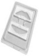

<!-- Slide number: 1 -->

<!-- Slide number: 2 -->

Trước tiên, Công Ty Cổ phần Capital Seaweed Consumer Việt Nam xin gửi lời cảm ơn chân thành đến Quý khách hàng đã quan tâm và tin tưởng các sản phẩm của chúng tôi.

Mọi chi tiết xin vui lòng liên hệ
CÔNG TY CỔ PHẦN CAPITAL SEAWEED CONSUMER VIỆT NAM
Địa chỉ: Số 05 Đường CN13, Nhóm Công Nghiệp 1, Khu Công Nghiệp Tân Bình, Phường Tây Thạnh, Tp. Hồ Chí Minh, Việt Nam.
Điện thoại: 0283 816 1769 - Hotline: 0903 894 200 (Zalo/ Viber/ WhatsApp)
Website: www.cscshop.vn - Email: support@csc-vn.com

| ĐỘI NGŨ KINH DOANH |  |  |  |
| --- | --- | --- | --- |
| Mr Đinh Tuấn Nam | 038 752 5924 | đinhtuannam@csc-vn.com |  |
| Mrs Nguyễn Thị Thủy | 090 937 4711 | nguyenthithuy@csc-vn.com |  |
| Ms. Từ Yến Anh | 093 218 5116 | tuyenanh@csc-vn.com |  |
| Ms. Lâm Thảo Vi | 089 846 7758 | lamthaovi@csc-vn.com |  |

<!-- Slide number: 3 -->
tài liệu đào tạo nội bộ và tư vấn khách hàng

<!-- Slide number: 4 -->

Làm đẹp dự phòng
予防美容編
# Mỹ phẩm giúp da sáng mịn khoẻ mạnh

Hãy bắt đầu với làm đẹp dự phòng!
Urutsuya charge LINE CARE

Mỗi tuần một lần
Sử dụng hai lần / tuổi không xác định
Trước sử dụng
Sau sử dụng

Sử dụng 1 tuần 1 lần – 6 lần/ độ tuổi 30
Sử dụng 1 tuần 2 lần / độ tuổi 30

<!-- Slide number: 5 -->

Khái quát về sản phẩm
Mỹ phẩm giúp da sáng mịn khoẻ mạnh
Chăm sóc về sau cho các vấn đề về da do khẩu trang!

Dành cho những ai đang lo lắng về việc “lỗ chân lông nở to” khi đeo khẩu trang trong thời gian dài!
Tên sản phẩm: Acropath・ Suhadabijin pore care
Công dụng: Ức chế tiết dầu, thu nhỏ lỗ chân lông, tăng độ đàn hồi cho da
Chứa: 4 lần dùng/hộp
Thành phần: Na hyaluronate, BG, nước, 1,2-hexanediol, chiết xuất hamamelis, pantenol, chiết xuất epilobium freshqueri, adenosine, chiết xuất bồ công anh, acetyl octapeptide-3, chiết xuất quả lựu
Cách dùng: dùng 2 ngày 1 lần,
Nơi sử dụng: Sau khi rửa mặt, dán ở nơi thấy vấn đề
Thời gian dán: Ít nhất từ 2 giờ trở lên ・ lúc ngủ
Giá bán: 1,936 yên (đã bao gồm thuế)

“Kích thước gấp đôi miếng dán cho vết thâm nám"

<!-- Slide number: 6 -->

Urutuya charge CooL LIP
Làm đẹp dự phòng

Khả năng chống lão hoá với oxy mức đơn của astaxanthine

Lip volume
＝kiểm tra độ căng！
Bình quân nam nữ độ tuổi 20~30
Bình quân nam nữ độ tuổi 40
Astaxanthine
Gấp 1,6 lần lycopene
Độ căng của môi

Gấp 2,6 lần lutein
Độ căng của môi
Gấp 4,9 lần beta-carotene
Lip volume
３００％ up
Gấp 75 lần α-lipoic acid
Gấp 560 lần Catechin ở trà xanh

Gấp 800 lần Coenzyme Q10
Khi dán miếng đắp vẫn mở miệng được ko sao！
Gấp 3000 lần Resveratrol
⁂Màu đỏ của axit
astaxanthine không còn lưu
lại da！
Gấp 6 000 lần vitaminC
Nguồn: cải biên từ
⁂Trạng thái không bôi son gì.

Sau khi dùng
Trước dùng
Ngay sau khi bỏ
Tiêm trong 2 giờ
⁂Các đầu kim khiến hơi nhói nhói! Nhưng ít kích thích

Tiêm collagen ・ axit hyaluronic, acid astaxanthin chống oxy hóa
Môi khô・bợt màu
Cải thiện khí sắc・nếp nhăn nhỏ, môi căng mướt
Astaxanthin được hấp thụ bởi môi và dần dần lan tỏa vào bên trong

<!-- Slide number: 7 -->

Làm đẹp dự phòng
Cách cung cấp hiệu quả chất chống oxy hóa
# Kim siêu vi (micro needle) chứa axit astaxanthin tan chảy
免疫細胞の多いところまで抗酸化物質を届けられる最も良い方法とは？
皮膚組織
皮膚は大きく角質層の存在する「表皮」と
Cách tốt nhất để đưa chất chống oxy hóa đến các khu vực có nhiều tế bào miễn dịch là gì?
Mô da
Da được phân loại thành "biểu bì", nơi có lớp sừng và ”trung bì" chứa collagen và elastin.

Đặc điểm của môi ・Tại sao môi có màu đỏ?
Lớp sừng của môi không có hiện tượng sừng hóa, mỏng hơn các vùng da khác và có đặc điểm gần giống với lớp hạ bì. Lớp hạ bì của môi có nhiều mạch máu hơn các vùng da khác, mạch máu trong suốt và có màu đỏ.

Sức khỏe môi "Chuyện bên lề"
Nhiễm vi rút herpes "herpes môi" do khả năng miễn dịch suy yếu là một bệnh trong đó mụn nước ngứa hình thành trên môi và xung quanh miệng.
Nó được chữa khỏi bằng cách ăn uống và bôi các chất chống oxy hóa. Môi cần chất chống oxy hóa.
コラーゲンやエラスチンを含む「真皮」で 分類
唇の特徴・唇はなぜ赤い？
唇の角質層は、角化現象がなく他の皮膚
に比べて薄く真皮に近い特徴がある。 唇の真皮には、他の皮膚より血管が多く
、血管が透けて赤い色となっている。

Thành phần chính: axit hyaluronic, vitamin C dạng ổn định, axit astaxanthin

Lớp sừng
Tiêm chất chống oxy hóa qua môi!
唇の健康「豆知識」
免疫力の低下によってヘルペスウイルス 感染症の「唇へルぺス」は、唇や口周り にかゆみを伴う水疱ができる疾患である
。
抗酸化物質を食べる、塗ることによって
治る。唇は抗酸化物質を必要とする。
Biểu bì
Trung bì

<!-- Slide number: 8 -->
tài liệu đào tạo nội bộ

tài liệu đào tạo nội bộ

<!-- Slide number: 9 -->

Làm đẹp dự phòng
# Clinical test result: anti-wrinkle
＜Beauty eye＞
Nữ tuổi 50: Sử dụng 3 ngày 1 lần trong 4 tuần, sau đó dù không sử dụng trong 1 tháng nhưng làn da săn chắc vẫn được duy trì.

Before use
1 week later
2 weeks later
3 weeks later
4 weeks later
8 weeks later
Stop using
Nam giới tuổi 50: Dùng 3 ngày 1 lần trong 5 tuần ・ Cải thiện tình trạng chùng nhão,  dưới mắt mịn bóng.
Before use
1 week later
2 weeks later
3 weeks later
4 weeks later
5 weeks later

tài liệu đào tạo nội bộ

<!-- Slide number: 10 -->

Làm đẹp dự phòng
# Clinical test result: anti-wrinkle
＜Beauty smile＞

before

after

tài liệu đào tạo nội bộ

<!-- Slide number: 11 -->

Chăm sóc SOS khẩn cấp
Giải cứu cho việc

Mỹ phẩm giúp da sáng mịn khoẻ mạnh
Mặt nạ đắp – chăm sóc SOS khẩn cấp cho các vấn đề ở da!
Đột nhiên lên mụn

#
Mỹ phẩm làm đẹp dự phòng giúp bảo vệ sức trẻ của làn da
✔Khi da bắt đầu tăng tốc độ lão hoá mới chăm sóc chống lão hoá là quá muộn
✔Hãy chuẩn bị để toả sáng khi tháo khẩu trang！
Thời đại「NO make」- mỹ phẩm chăm sóc làn da trần
✔ Chăm sóc kịp thời các vấn đề về da do đeo khẩu trang lâu ngày
✔Để có làn da trong suốt, hãy bắt đầu với việc chăm sóc da khỏe mạnh ~
✔ Chăm sóc phục hồi vẻ đẹp vốn có của làn da
AC CARE
Các thành phần niacinamide oligopeptide-76, natri hydroxit
axit hyaluronic
Mỹ phẩm nâng cao「miễn dịch da」
✔Cung cấp các thành phần dinh dưỡng giúp tăng cường miễn dịch cho da trực tiếp vào da
✔ Không có thành phần gây hại cho da!
✔ Mỹ phẩm không sử dụng chất bảo quản, paraben, hương thơm nhân tạo, chất màu thành phần động vật
Kim siêu vi

tài liệu đào tạo nội bộ

<!-- Slide number: 12 -->

Chăm sóc SOS khẩn cấp
Mỹ phẩm giúp da sáng mịn khoẻ mạnh
Mặt nạ đắp – chăm sóc SOS khẩn cấp cho các vấn đề ở da!
tài liệu đào tạo nội bộ
■
効果：ニキビ、吹き出物の改善
■
全成分：ヒアルロン酸、ナイアシンアミド、オ リゴペプチド-76、水酸化Ｎａ
Tên sản phẩm: Acropath ・AC care・plus
Công dụng: Cải thiện mụn
Chứa: 9 miếng/hộp
Thành phần : Axit hyaluronic, Niacinamide, origopeptide-76, natri hydroxit
Giá bán:3,190 yên (đã bao gồm thuế)
Night care
|  |  |  |
| --- | --- | --- |
|  | ナイトケア用 |  |
| G マイクロニードルでアクネ菌解決 マイクロニードルで殺菌・抗炎症成分を 肌悩みの部分に直接注入❕ ２時間でニキビの原因・アクネ菌抑制 |  |  |
販売名：アクロパス・エイシーケア・プラス

Giải quyết khuẩn acne với kim siêu vi
Kim siêu vi giúp tiêm trực tiếp các thành phần sát khuẩn-chống viêm tới các phần da có vấn đề.
Áp chế khuẩn acne-nguyên nhân gây mụn chỉ với 2 giờ
内容：９patch/BOX

■
販売Giá：３,１９０ yên (đã bao gồm thuế)
Skin cleanser

肌Lau
鎮静作用の高いティーツリーオイル 成分が、肌に付着している汚れを
きれいに拭き取ります。
Lau và làm sạch da
Thành phần dầu cây trà có tác dụng cao với việc làm dịu da, lau làm sạch bụi bẩn bám trên da.
Day care

Day care
Miếng che mẩn đỏ- bảo vệ
(cho 9 lần)
Night care
Skin cleanser
(cho 9 lần)
Night care
Miếng dán kim siêu vi
(cho 9 lần)
ハ	イドロコロイド湿潤バンド
肌トラブルで赤くなったニキビの上
に付着し、皮膚を保護・赤みを隠す
！その上からメイクも可能に。
Băng ướt hydrocolloid
Dán lên mụn đã đỏ tấy do các vấn đề về da, bảo vệ da và che đi vết mẩn đỏ! Có thể trang điểm bên trên.
tài liệu đào tạo nội bộ

<!-- Slide number: 13 -->

Chăm sóc SOS khẩn cấp
Mỹ phẩm giúp da sáng mịn khoẻ mạnh
Mặt nạ đắp – chăm sóc SOS khẩn cấp cho các vấn đề ở da!

Dùng cho ban đêm・NIGHTCARE・miếng dán kim siêu vi tan chảy (9 lần)
✔Các kim siêu vi tan chảy cung cấp axit hyaluronic nồng độ cao và các thành phần hoạt tính * vào sâu bên trong da!
✔Thành phần hoạt tính * tan chảy từ sâu bên trong da khi bạn ngủ, ngăn chặn sự phát triển của vi khuẩn acnes!
✔*Tới lớp sừng！
▲Video về kim siêu vi▲

Người mẫu Maya Tanaka- Instagram
Luôn chuẩn bị sẵn phòng trường hợp bạn đột nhiên lên mụn! Acropath AC Care Plus

tài liệu đào tạo nội bộ

### Notes:

<!-- Slide number: 14 -->

Chăm sóc SOS khẩn cấp
Mỹ phẩm giúp da sáng mịn khoẻ mạnh
Mặt nạ đắp – chăm sóc SOS khẩn cấp cho các vấn đề ở da!
#

Dùng ban ngày・DAYCARE・ Hydrocolloid dạng miếng（15 lần）
✔Nguyên liệu mới ở dược phẩm dùng ở khoa da liễu, giúp xoá nám và thúc đẩy tái sinh da sau điều trị laser để không để lại vết sẹo
✔Dán lên trên nơi mụn đỏ để bảo vệ da, che vết đỏ, có thể trang điểm bên trên miếng dán
Cấu thành môi trường ẩm

Ngăn nước ở sinh hoạt hàng ngày
Tác dụng của miếng Hydrocolloid

Ngăn nước
Chặn đứng vi khuẩn
Hydrocolloid
Bảo vệ da

Cấu thành môi trường ẩm
Miếng có viền mỏng
Biểu bì

Trung  bì
Độ bám dính tốt

tài liệu đào tạo nội bộ

<!-- Slide number: 15 -->

Chăm sóc SOS khẩn cấp
Mỹ phẩm giúp da sáng mịn khoẻ mạnh
Mặt nạ đắp – chăm sóc SOS khẩn cấp cho các vấn đề ở da!
#

Gói “6 lần” để dùng thử
Tên sản phẩm: Acropath ・AC care
Công dụng: Cải thiện mụn
Chứa: 6 miếng/hộp
Thành phần : Axit hyaluronic, Niacinamide, origopeptide-76, natri hydroxit
Giá bán:1,870 yên (đã bao gồm thuế)

■
効果：ニキビ、吹き出物の改善
■
全成分：ヒアルロン酸、ナイアシンアミド
、オリゴペプチド-76、水酸化Ｎａ
販売名：アクロパス・エイシーケア
内容：６patch/BOX

販売Giá：１,８７０ yên (đã bao gồm thuế)
突然のにきび・肌トラブル どうしますか？
２時間で赤みが消える！ アナウンサーやモデル 話題のアイテムです。
Bạn phải làm gì với mụn trứng cá đột ngột và các vấn đề về da?
Vết đỏ biến mất sau 2 giờ! Sản phẩm là chủ đề nóng với các phát thanh viên và người mẫu

tài liệu đào tạo nội bộ

<!-- Slide number: 16 -->

Chăm sóc SOS khẩn cấp
tài liệu đào tạo nội bộ
ACROPASS│Kênh bán hàng online

💖Acropass được các người mẫu và các influencer ưa thích

<!-- Slide number: 17 -->

Chăm sóc SOS khẩn cấp
# クリアで健やかなお肌へと導くコスメ
マスク下の肌トラブルのアフターケア～！
Mỹ phẩm giúp da sáng mịn khoẻ mạnh
Chăm sóc về sau cho các vấn đề về da dưới khẩu trang!

Dành cho những ai đang lo lắng về “làn da mẩn đỏ” ​​ khi đeo khẩu trang trong thời gian dài!
Tên sản phẩm: Acropath・ BUG patch
Công dụng: Chứa glycyrrhizic acid 2K, được cho là có tác dụng tương tự như thuốc kháng histamine, có tác dụng chống viêm ・ chống dị ứng ・ làm dịu mẩn đỏ và ngứa da, cải thiện làn da thô ráp.
Chứa: 6 lần dùng/hộp
Thành phần: Na hyaluronate, glycyrrhizic acid 2K, niacinamide, dầu lá trà, Caffeoyl sh-Decapeptide-9
Cách dùng: dùng 2 ngày 1 lần,
Nơi sử dụng: Sau khi rửa mặt, dán ở nơi thấy vấn đề
Thời gian dán: Ít nhất từ 2 giờ trở lên ・ lúc ngủ
Giá bán: 1,518 yên (đã bao gồm thuế)

tài liệu đào tạo nội bộ

<!-- Slide number: 18 -->

Chăm sóc SOS khẩn cấp
クリアで健やかなお肌へと導くコスメ
Mỹ phẩm giúp da sáng mịn khoẻ mạnh
Chăm sóc về sau cho các vấn đề về da do khẩu trang!
# マスクトラブルのアフターケア～！

tài liệu đào tạo nội bộ

<!-- Slide number: 19 -->

# 商品概要
Chăm sóc về sau
Chỉ cần dán vào phần da có vấn đề
Mỹ phẩm giúp da sáng mịn khoẻ mạnh
Chăm sóc về sau cho các vấn đề về da do khẩu trang!
クリアで健やかなお肌へと導くコスメ
マスクトラブルのアフターケア～！
Chăm sóc làn da trần dưới khẩu trang
Dành cho những ai đang lo lắng về vết mụn và da xỉn màu do khẩu trang
Tên sản phẩm: Acropath・ Suhadabijin Vita spot
Công dụng: Cải thiện da xỉn màu, thâm nám, nâng tông da
Chứa: 6 lần dùng/hộp
Thành phần: Axit hyaluronic, axit ascorbic (vitamin C), arbutin, chiết xuất cam thảo, niacin amid, dầu hạt macadamia, axit citric
Cách dùng: dùng 2 ngày 1 lần,
Nơi sử dụng: Sau khi rửa mặt, dán ở nơi thấy vấn đề
Thời gian dán: Ít nhất từ 2 giờ trở lên ・ lúc ngủ
Giá bán: 1,870 yên (đã bao gồm thuế)
Các thành phần niacinamide Glutathione oxit, Ascorbic acid
Suhada bijin VITA
axit hyaluronic
Kim siêu vi

tài liệu đào tạo nội bộ

<!-- Slide number: 20 -->

Chăm sóc về sau
Chỉ cần dán vào phần da có vấn đề
Mỹ phẩm giúp da sáng mịn khoẻ mạnh
Chăm sóc về sau cho các vấn đề về da do khẩu trang!
#
Chăm sóc làn da trần dưới khẩu trang
Mỹ phẩm làm đẹp dự phòng giúp bảo vệ sức trẻ của làn da
✔Khi da bắt đầu tăng tốc độ lão hoá mới chăm sóc chống lão hoá là quá muộn
✔Hãy chuẩn bị để toả sáng khi tháo khẩu trang！
Các thành phần niacinamide Glutathione oxit, Ascorbic acid
Suhada bijin VITA
Thời đại「NO make」- mỹ phẩm chăm sóc làn da trần
✔ Chăm sóc kịp thời các vấn đề về da do đeo khẩu trang lâu ngày
✔Để có làn da trong suốt, hãy bắt đầu với việc chăm sóc da khỏe mạnh ~
✔ Chăm sóc phục hồi vẻ đẹp vốn có của làn da
axit hyaluronic
Mỹ phẩm nâng cao「miễn dịch da」
✔Cung cấp các thành phần dinh dưỡng giúp tăng cường miễn dịch cho da trực tiếp vào da
✔ Không có thành phần gây hại cho da!
✔ Mỹ phẩm không sử dụng chất bảo quản, paraben, hương thơm nhân tạo, chất màu thành phần động vật
Kim siêu vi

tài liệu đào tạo nội bộ

<!-- Slide number: 21 -->

Chăm sóc về sau
Kim siêu vi ”Suhada bijin VITA-C“ đem đến sức khoẻ và ánh sáng cho làn da gắng sức
Thành phần chính
Arbutin: Thành phần làm trắng tự nhiên giúp ngăn chặn sự sản sinh quá mức của melanin
Axit ascorbic: Loại bỏ vết nám bằng cách ngăn chặn từ gốc rễ sự tổng hợp và sản xuất sắc tố melanin.
Niacin Amid:  Ngăn không cho sắc tố melanin di chuyển lên bề mặt da.
Chiết xuất cam thảo: Phân hủy các sắc tố melanin có trong lớp sừng của da.
Axit hyaluronic: Hiệu quả dưỡng ẩm mạnh mẽ

before
after

tài liệu đào tạo nội bộ

<!-- Slide number: 22 -->

Chăm sóc về sau
# Cơ chế giãn nở lỗ chân lông
✔ Tiết bã nhờn → Chỉ rửa mặt kỹ trên bề mặt da: Da bị khô ・ gây tổn thương da
✔ Tăng lượng bã nhờn do khô → Tiết ・ tích tụ bã nhờn quá mức: Bã nhờn tích tụ trong lỗ chân lông và làm giãn nở lỗ chân lông
✔ Rửa mặt mạnh hơn khi lượng bã nhờn tăng lên → Giảm độ đàn hồi của da: Đẩy nhanh quá trình lão hóa

Vòng tuần hoàn xấu
Bã nhờn tiết quá mức
Tích tụ bã nhờn trong lỗ chân lông
Bã nhờn tích tụ cản trở lỗ chân lông khiến lỗ chân lông ngày càng giãn ra!
Khiến da giảm độ ẩm và độ đàn hồi lại càng giảm độ đàn hồi và dễ bị lão hóa

Lông

Da: chức năng rào chắn
Bã nhờn:
₋ Tiết quá nhiều: tích tụ
₋ Vi khuẩn sinh sôi
₋ Nguyên nhân gây ra mụn và các vấn đề về da
能
Tuyến bã nhờn: bài tiết

Lỗ chân lông: Con đường của bã nhờn
₋ Bã nhờn dễ tích tụ gây giãn nở lỗ chân lông

tài liệu đào tạo nội bộ

<!-- Slide number: 23 -->

Chăm sóc về sau
# Giải quyết nguyên nhân gây giãn nở lỗ chân lông cho làn da mịn màng và tươi trẻ

1,2-Hexanediol
biện pháp kháng khuẩn và ngăn ngừa tình trạng khô ráp trên bề mặt da ！
1,2-Hexanediol là thành phần kháng khuẩn dưỡng ẩm gọi là "polyol"

D-Panthenol
Tăng độ đàn hồi của da và se khít lỗ chân lông
Giúp da căng hơn!
Axit hyaluronic
Cấp nước
Giúp da có độ ẩm!
Chiết suất cây Dwarf Fireweed
Phân giải các khối bã nhờn
Áp chế việc tiết bã nhờn
là nguyên nhân gây giãn lỗ chân lông và thâm lỗ chân lông
Chiết xuất Hamamelis
Se khít lỗ chân lông
Tác dụng se lỗ chân lông
Giúp da trơn mướt
皮脂分泌を抑制する
皮脂の塊を溶解

tài liệu đào tạo nội bộ

<!-- Slide number: 24 -->

Chăm sóc về sau
# Thành phần chăm sóc lỗ chân lông

Chiết suất Epilobium Freiskeli
(Alpsie Bum)

D-Panthenol
(Provitamin B5)

Tinh chất hamamelis
Hyaluronic acid (HA)

・Tác dụng làm se khít lỗ chân lông tuyệt vời
・Thu nhỏ lỗ chân lông
・Điều hòa kết cấu của da
・Tác dụng thúc đẩy chữa lành thương tổn
・Dưỡng ẩm ・giữ ẩm
・Cải thiện nếp nhăn ・chảy xệ
・Tăng cường rào chắn cho da
・Tăng độ đàn hồi
・Tái sinh làn da
・Tăng cường rào chắn cho da
・Ức chế việc tiết bã nhờn
・Tác dụng se khít lỗ chân lông
・Kháng viêm
1,2-Hexanediol là thành phần kháng khuẩn dưỡng ẩm được gọi là "polyol".
Ức chế việc tiết  bã nhờn
Phân giải khối bã nhờn
Tăng độ đàn hồi・Tăng cường rào chắn cho da
Thu nhỏ lỗ chân lông

tài liệu đào tạo nội bộ

<!-- Slide number: 25 -->

Chăm sóc về sau
Clinical test result
Giảm tiết bã nhờn khoảng 20% ​​/ tăng gấp đôi hàm lượng nước và độ đàn hồi / thu nhỏ lỗ chân lông từ 10% trở lên
Lỗ chân lông: thu nhỏ khoảng 10%
Độ ẩm / độ đàn hồi: Tăng gấp đôi

|  | Before | After (giá trị bình quân) |
| --- | --- | --- |
| Độ ẩm | 44 | 79 |
| Độ đàn hồi | 42 | 73 |
【 Ảnh phân tích】
【 Ảnh chụp】
Kích cỡ lỗ chân lông: thu nhỏ khoảng 10%

【 Ảnh chụp】
【 Ảnh phân tích】
Lượng bã nhờn: Giảm khoảng 20%

tài liệu đào tạo nội bộ
使用前
使用後
Sau sử dụng
Trước sử dụng

<!-- Slide number: 26 -->

Tư duy của chúng tôi...đơn giản nhưng hiệu quả thiết thực
BEAUTY FORCE FOR YOUR NATURAL SKIN
~chăm sóc da thách thức mọi sự thay đổi~
Bihada Factory
tài liệu đào tạo nội bộ

<!-- Slide number: 27 -->

Tư duy của chúng tôi...đơn giản nhưng hiệu quả thiết thực
BEAUTY FORCE FOR YOUR NATURAL SKIN
~chăm sóc da thách thức mọi sự thay đổi~
Bihada Factory

Bihada Factory là thương hiệu trực tiếp mang những thành phần công hiệu cần thiết tới làn da.
☆ thương hiệu tiếp cận bản chất sức khoẻ của da, giải quyết gốc rễ những vấn đề ở da
☆ thương hiệu hoạt động tích cực nhằm tạo nên làn da khoẻ mạnh
☆ thương hiệu đặc biệt - đơn giản nhưng hiệu quả tích cực
「美肌factory」は、☆肌が必要とする有効成分をダイレクトに届けるブランド

☆肌健康の本質にアプローチし、肌悩みを根本的に解決するブランド

☆健やかな肌をつくり上げるためにアクティブに働くブランド

☆シンプルでも確かな効果を出すスペシャルブランド

tài liệu đào tạo nội bộ

<!-- Slide number: 28 -->

Về làn da
肌・皮膚について
Da
Da là một cơ quan, là lớp bao phủ toàn cơ thể. Nó ngăn cách bên trong bên ngoài cơ thể. Nhìn từ phía ngoài nó được cấu thành từ các mô biểu bì, trung bì, hạ bì. Da có chức năng điều tiết nhiệt độ, là rào chắn cho cơ thể khỏi môi trường bên ngoài. Biểu bì da người trung bình khoảng 0.1~0.3mm, trung bì từ 2.0~2.2mm khác nhau tuỳ theo vùng tay hay lòng bàn chân.

Thượng bì
Thượng bì được cấu thành chủ yếu bởi các tế bào sừng (keratinocyte). Tế bào đuôi gai ở lớp này có tế bào hắc tố (melanocytes), tế bào Langerha, tế bào Merkel ((tế bào xúc giác). Đặc biệt, tế bào sừng ở biểu bì được ví như những viên gạch cùng với phần lipid ở giữa các tế bào được ví như xi măng giúp cấu thành cấu trúc dạng phiến (lamellar), chức năng rào chắn của da được đảm bảo nhờ sự vẹn toàn của lớp sừng này. Và, chức năng của nó có chức năng rào chắn với tác động mang tính vật lý, với tia tử ngoại, các vật chất gây hại, vi sinh vật, cùng chức năng giữ ẩm, chức năng miễn dịch, chức năng chống oxy hoá, chức năng chống khuẩn/chống viêm, chức năng tái tạo. Thêm vào đó, tế bào sừng có lipid giữa các tế bào sừng giúp gắn kết chúng với nhau, đóng vai trò che chắn để các kích thích từ bên ngoài không vào được bên trong với thành phần chủ yếu là ceramide.

Trung bì
Trung bì nằm dưới lớp thượng bì, dày gấp tầm 10~40 lần so với thượng bì. Trong lớp trung bì hình lưới, “sợi đàn hồi elastin” được phân bố theo kiểu lưới ở thể liên kết “ sợi liên kết collagen ” giúp mang lại sự dẻo dai cho da. Nó còn chứa cả axit hyaluronic, có tác dụng giữ nước. Ngoài ra, còn có các nguyên bào sợi sản xuất ra các sợi collagen và các tế bào mast có liên quan đến chức năng miễn dịch và chứng viêm. Các dây thần kinh đi đến lớp biểu bì, nhưng sự phát triển của các mao mạch dừng lại bên trong lớp hạ bì. Lớp hạ bì có các tuyến eccrine và apocrine tiết ra mồ hôi.
皮膚
皮膚は、器官のひとつで、体の表面をおおっている層のこと。体の内外を区切り、外側から見ると表皮、真皮、皮下 組織で構成されている。体温調節と外部環境からのバリア機能などを持っている。人の皮膚の表皮は平均0.1-0.3mm、

Lớp sừng
Lớp hạt
Biểu bì
Lớp  gai
Lớp đáy
Màng đáy
Tế bào đáy
Collagen
Trung bì
Elastin
Nguyên bào sợi
 Cơ chất
Mỡ dưới da
Mô hạ bì
Màng cơ
Cơ
真皮は2.0〜2.2mmだが、手や足の裏など場所によって異なる。

表皮
表皮は主に「ケラチノサイト」という細胞で形成されている。この層の「樹状細胞」にはメラノサイト、ランゲルハ
ンス細胞、メルケル細胞（感触細胞）等がある。特に表皮にある角質細胞（ケラチン）は、レンガに例えられる角質 細胞と、セメントに例えられる細胞間脂質でできた壁のようなものでラメラ構造となっており、皮膚バリア機能は角 質層の完全性によって保たれている。また、機能としては、物理的、紫外線、有害物質、微生物に対するバリア機能
、保湿機能、免疫機能、抗酸化機能、抗菌・抗炎症機能、再生機能があります。 また、角質細胞に「角質細胞間脂質

」があり、細胞同士を密着させ、外部からの刺激が入り込まないように肌のバリア機能を担っている。主成分は「セ
ラミド」。
真皮
真皮は、表皮の下に存在し、表皮より約１０～４０倍の厚み。真皮の網状層には、「結合繊維のコラーゲン」の結合 体に「弾性繊維のエラスチン」が網状に分布し皮膚本体に強靭さを与える。また、水分を維持するヒアルロン酸も含 まれる。他にコラーゲン繊維をつくる線維芽細胞や免疫機能、炎症などに関与する肥満細胞（マスト細胞）がある。
神経は表皮まで到達するが毛細血管の伸びは、真皮内までに止まる。真皮には汗を分泌するエクリン腺とアポクリン 腺がある。

tài liệu đào tạo nội bộ

<!-- Slide number: 29 -->

tài liệu đào tạo nội bộ
Về làn da

Tế bào sừng
(nhân tố giữ ẩm tự nhiên)
Màng da
Biểu bì
Lớp sừng
Lớp hạt
Biểu bì
Lớp  gai
Lớp đáy
Collagen
Trung bì
Nguyên bào sợi
Elastin
Hyalluron acid
Mô hạ bì
Mỡ dưới da

Lớp sừng
Lớp sừng
Lớp đáy
Trung bì
Elastin
Collagen
Lipid giữa các tế bào sừng (ceramide)
Nước
Mô hạ bì
Hyalluron acid
【Thành phần không thể thiếu giúp da căng mịn đàn hồi】
Ceramide
【Thành phần ở lớp trung bì giúp nâng đỡ da】
Elastin
Collagen
Hyalluron acid
「表皮」には細胞がレンガ状に並んでその間を埋 め尽くすように存在する「角質細胞間脂質」があ る。細胞同士を密着させ、外部からの刺激が入り 込まないように肌のバリア機能を担っている。主 成分は「セラミド」という脂質で、量が減ると肌 が乾燥する上、細胞の隙間から刺激が入り、赤み
、かゆみなども生じる。肌を強く洗うとセラミド
Ở biểu bì có lipid giữa các tế bào sừng giúp gắn kết các tế bào xếp hình gạch. Chúng giúp các tế bào gắn kết và đóng vai trò rào chắn cho da để các kích thích từ bên ngoài không vào được. Thành phần chủ yếu là chất béo gọi là ceramide. Lượng ceramide giảm không những khiến da khô mà còn khiến các kích thích vào được từ khe hở tế bào gây mẩn đỏ, ngứa...Cần chú ý là nếu rửa cọ mạnh ceramide sẽ bị tan và rửa trôi đi!
Cơ thịt
「インフルエンザの予防接種」を皮下に注射するのは、 皮下即ち真皮には、免疫に関係する樹状細胞が多くここに 注射液を送り込み、免疫細胞にインフルエンザの抗原を覚 えてもらうようにするためである。
樹状細胞は、表皮に存在するランゲルハンス細胞をはじめ
Việc tiêm phòng bệnh cúm được tiêm dưới da là do thuốc tiêm được chuyển tới phần trung bì ngay dưới da nơi có nhiều tế bào đuôi gai liên quan tới miễn dịch, giúp các tế bào miễn dịch ghi nhớ được kháng nguyên cúm.
Tế bào đuôi gai phải kể đến các tế bào langerhans tồn tại ở thượng bì
Mỡ dưới da
が溶けて流れ出すので注意！
Nguồn: " Bác sĩ da liễu dạy, đâu là nguyên nhân gây lão hóa da (2019, 03, 23)", Ayako Onozuka (ảnh minh họa), President Woman

<!-- Slide number: 30 -->

KARADA ARRANGE
by Bihada Factory

ACROPASS
by Bihada Factory

| Chăm sóc sắc đẹp về sau |  |
| --- | --- |
|  |  |
| Pore | Care |
|  |  |
| Suhada bijin VITA |  |
| Chăm sóc sắc đẹp về sau |  |
| --- | --- |
|  |  |
| Stability Stability lactic acid bacteria (hạt) 1 nghìn tỷ lợi khuẩn axit lactic 1 tuần (7 gói) 30 ngày (30 gói) |  |

Làm đẹp dự phòng
SOS
Chăm sóc sắc đẹp khẩn cấp
SOS
Chăm sóc sắc đẹp khẩn cấp
Làm đẹp dự phòng

PREMIUM
for WOMEN

Beau
ty eye
AC Care
Recovery
(Hạt)
500 tỷ lợi khuẩn axit lactic
axit ascorbic
Collagen ceramide
Smoothly

Smoothly lactic acid bacteria (xi-rô)
PREMIUM

lợi khuẩn  lactic 500 tỷ ・
Oligosaccharide / chất xơ thực phẩm
AC Car
e plus

Beauty
Smile

BUG
Suhada Care
1 tuần (7 gói)
1 tháng (20 gói)

Line
care
for WOMEN

Relaxy
Thư giãn với lợi khuẩn axit lactic
(Muối tắm) 1 nghìn tỷ lợi khuẩn axit lactic axit hyaluronic

CooL LIP

Rào chắn chống cúm
Kẹo ngậm

Thực phẩm chức năng dạng kẹo
Lợi khuẩn axit lactic tăng cường

tài liệu đào tạo nội bộ

<!-- Slide number: 31 -->

ACROPASS
Đưa tới trực tiếp các thành phần công hiệu
tài liệu đào tạo nội bộ

<!-- Slide number: 32 -->

Làm đẹp dự phòng
# Mỹ phẩm giúp da sáng mịn khoẻ mạnh

予防美容をはじめよう～！
Hãy bắt đầu với làm đẹp dự phòng!
Mỹ phẩm làm đẹp dự phòng giúp bảo vệ sức trẻ của làn da
✔Khi da bắt đầu tăng tốc độ lão hoá mới chăm sóc chống lão hoá là quá muộn
✔Hãy chuẩn bị để toả sáng khi tháo khẩu trang！
Thời đại「NO make」- mỹ phẩm chăm sóc làn da trần
✔ Chăm sóc kịp thời các vấn đề về da do đeo khẩu trang lâu ngày
✔Để có làn da trong suốt, hãy bắt đầu với việc chăm sóc da khỏe mạnh ~
✔ Chăm sóc phục hồi vẻ đẹp vốn có của làn da
Mỹ phẩm nâng cao「miễn dịch da」
✔Cung cấp các thành phần dinh dưỡng giúp tăng cường miễn dịch cho da trực tiếp vào da
✔ Không có thành phần gây hại cho da!
✔ Mỹ phẩm không sử dụng chất bảo quản, paraben, hương thơm nhân tạo, chất màu thành phần động vật
Bạn hãy thử cười xem! ”Các đường biểu cảm trên khuôn mặt“ được tạo ra thời điểm đó là bản tóm tắt về cuộc đời bạn, nhưng nó sẽ là các nếp nhăn trong tương lai.
Ngay từ giờ hãy cùng đón chào nụ cười thật đẹp nhé!

tài liệu đào tạo nội bộ

<!-- Slide number: 33 -->

Làm đẹp dự phòng
# Thí nghiệm so sánh việc bôi lotion với dán miếng chứa kim siêu vi
Nile red Cream VS. Microneedle Path

Microneedle Tỷ lệ hấp thụ khoảng 99%
Cần 2 giờ
Lotion
Tỷ lệ hấp thu 5%
Cần 24 giờ

* Trong thử nghiệm này, thuốc nhuộm màu đỏ được sử dụng thay cho axit astaxanthin để xác nhận tốc độ hấp thụ.
tài liệu đào tạo nội bộ

<!-- Slide number: 34 -->

KARADA ARRANGE
By Bihada Factory

Enterococcus  faecalis
高濃度乳酸菌で体の内側から免疫を高める
カラダの中から健康的に美しく整える！ イナーフローラとイナービューティーを
目指して誕生した乳酸菌スペシャルブランド
Tăng khả năng miễn dịch từ bên trong cơ thể với lợi khuẩn axit lactic nồng độ cao
Giúp cơ thể khỏe mạnh và xinh đẹp từ bên trong!
 Thương hiệu đặc biệt chứa lợi khuẩn lactic ra đời với mục đích hướng tới hệ vi sinh vật bên trong và vẻ đẹp bên trong
tài liệu đào tạo nội bộ

<!-- Slide number: 35 -->

KARADA ARRANGE │Các sản phẩm chứa lợi khuẩn axit lactic

Lợi khuẩn lactic Body arrange Stability
(dạng hạt)
Lợi khuẩn lactic Body arrange Relaxy (muối tắm)
Lợi khuẩn lactic Body arrange Smoothly
(xi-rô)
Lợi khuẩn lactic Body arrange recovery (dạng hạt)
Tên sản phẩm
| Dung lượng・Giá |  | 1g×１４gói |  | ４０ｇ×３ viên |  | １０ｇ×２０ gói | １０ｇ×７ gói |  | １g×３０ gói | １g×７ gói |
| --- | --- | --- | --- | --- | --- | --- | --- | --- | --- | --- |
| (đã bao gồm thuế) |  | Giá：3,218 yên |  | Giá：1,078 yên |  | Giá：4,928 yên | Giá：1,620 yên |  | Giá：5,378 yên | Giá：1,058 yên |

💛Chăm sóc khử mùi vùng kín
💛 Kỳ vọng ngăn chặn nấm Candida
💛 Làm ấm cơ thể và cải thiện lưu thông máu

💛 Cải thiện môi trường ruột và để đi ngoài tốt
💛 Giảm táo bón
💛 Cải thiện môi trường ruột

💛 Nhiều lợi khuẩn  axit lactic hỗ trợ mạnh mẽ khả năng miễn dịch
💛 Giảm / cải thiện dị ứng
💛 Kỳ vọng ngăn ngừa hội chứng chuyển hóa

💛Chăm sóc tập trung 2 tuần・cho sức khoẻ nữ giới
💛Kỳ vọng phòng ngừa viêm âm đạo
💛Giải pháp cho việc kho da
💛Hiệu qủa đẹp da
💛Tăng cường miễn dịch nhờ lợi khuẩn lactic

Đặc điểm

500 tỷ lợi khuẩn axit lactic, chất xơ, oligosaccharide

1 nghìn tỷ lợi khuẩn axit lactic

500 tỷ lợi khuẩn axit lactic
Collagen tripeptide, chiết xuất mầm gạo (chứa ceramide), vitamin C
1 nghìn tỷ lợi khuẩn axit lactic, axit hyaluronic

Thành phần chính

Vị sữa chua

Hầu như không mùi không vị

Chua ngọt

Hương hoa hồng

Vị/mùi
tài liệu đào tạo nội bộ

<!-- Slide number: 36 -->

KARADA ARRANGE │Các sản phẩm chứa lợi khuẩn axit lactic

Body arrange recovery -Lợi khuẩn lactic dạng hạt
Thực phẩm chức năng cho phụ nữ
Chứa 500 tỷ lợi khuẩn axit lactic ngăn chặn nấm Candida là một trong những nguyên nhân gây viêm âm đạo ở phụ nữ
Lợi khuẩn axit lactic nồng độ cao + collagen + ceramide + vitamin C
女性のためのサプリメント
女性膣炎の原因の一つであるカンジダ菌を抑制する乳酸菌を５千億個配合 高濃度乳酸菌＋コラーゲン＋セラミド＋ビタミンC
販売名：カラダアレンジ リカバリー乳酸菌顆粒
効果：女性膣炎の原因の一つであるカンジダ菌を抑制する乳酸菌で免疫力を強化。角質の水分保持やバリア機 能で重要な役割を担うセラミドで肌荒れを改善、コラーゲンとビタミンCで肌と軟骨の健康維持

内容：１ｇ×１４ gói / BOX

全成分：コラーゲンペプチド（国内製造）（ゼラチンを含む）、難消化性デキストリン、乳酸菌末、はっ酵乳パウダー
(はっ酵乳、デキストリン、ぶどう糖)（乳成分を含む）、米胚芽抽出物 / ビタミンC、クエン酸、香料、甘味料（ステビ ア）、乳酸

お召し上げり方：健康補助食品として１日１ góiを目安にそのまま、または水などでお召し上がりください。

賞味期限：２年

製造国：日本

Tên sản phẩm: Lợi khuẩn lactic Body arrange recovery dạng hạt
Công dụng:  Lợi khuẩn axit lactic giúp tăng cường khả năng miễn dịch và ức chế nấm Candida là một trong những nguyên nhân gây viêm âm đạo ở nữ giới. Ceramide đóng vai trò quan trọng với chức năng rào cản cho da và giữ nước cho chất sừng, giúp cải thiện làn da thô ráp. Collagen và vitamin C duy trì sức khỏe của da và sụn.
Chứa: １ｇ×１４ gói / hộp
Thành phần: Collagen peptide (sản xuất tại Nhật) (bao gồm gelatin), dextrin khó tiêu, bột lợi khuẩn axit lactic, sữa bột lên men (sữa lên men, dextrin, glucose) (bao gồm cả thành phần sữa), chiết xuất mầm gạo/ vitamin C, axit citric, hương liệu, Chất tạo ngọt ( stevia), axit lactic
Cách dùng: thực phẩm chức năng, uống 1 gói mỗi ngày không kèm nước hoặc với nước.
Hạn sử dụng: 2 năm
Quốc gia sản xuất: Nhật Bản
Giá bán: 3,218 yên (đã bao gồm thuế)

tài liệu đào tạo nội bộ

<!-- Slide number: 37 -->

KARADA ARRANGE │Các sản phẩm chứa lợi khuẩn axit lactic

Body arrange recovery -Lợi khuẩn lactic dạng hạt
Thực phẩm chức năng cho phụ nữ
Chứa 500 tỷ lợi khuẩn axit lactic ngăn chặn nấm Candida là một trong những nguyên nhân gây viêm âm đạo ở phụ nữ
Lợi khuẩn axit lactic nồng độ cao + collagen + ceramide + vitamin C
女性のためのサプリメント
女性膣炎の原因の一つであるカンジダ菌を抑制する乳酸菌を５千億個配合 高濃度乳酸菌＋コラーゲン＋セラミド＋ビタミンC

| Lợi khuẩn axit lactic | Collagen tripeptide | Ceramide Ceramide có nguồn gốc từ gạo | Vitamin C |
| --- | --- | --- | --- |
| Ức chế nấm Candida -Nguyên nhân chính gây ra bệnh viêm âm đạo ở nữ giới | Tác dụng làm lành vết thương sụn nhanh chóng |  |  |
| Điều hòa đường ruột, tăng cường miễn dịch | thành phần chính của xương |  |  |
| 整腸作用、免疫強化 | Thúc đẩy tổng hợp canxi | Bảo vệ da khỏi bị kích ứng =Thành phần thiết yếu của "chức năng rào cản" | Tạo làn da đẹp, Giúp hấp thụ sắt, Là chất dinh dưỡng cần thiết để tổng hợp collagen |
| 500 tỷ khuẩn trong một lần dùng | Cấu trúc phân tử nhỏ hơn collagen nói chung |  |  |
| Bằng 500 hộp sữa chua | → Tỷ lệ hấp thụ cao → Tốc độ hấp thụ nhanh |  |  |
tài liệu đào tạo nội bộ

<!-- Slide number: 38 -->

KARADA ARRANGE │Các sản phẩm chứa lợi khuẩn axit lactic

Body arrange relaxy – muối tắm chứa lợi khuẩn lactic
# カラダアレンジ リラクシー 乳酸菌入浴料
Muối tắm cho phụ nữ
Chứa 1000 tỷ lợi khuẩn axit lactic ngăn chặn nấm Candida là một trong những nguyên nhân gây viêm âm đạo ở phụ nữ
Lợi khuẩn axit lactic nồng độ cao + thành phần dưỡng ẩm da axit hyaluronic
女性のための入浴料
女性膣炎の原因の一つであるカンジダ菌を抑制する乳酸菌を１兆個配合 肌保湿成分ヒアルロン酸＋高濃度乳酸菌配合

販売名：カラダアレンジ リラクシー乳酸菌入浴料

効果：女性膣炎の原因の一つであるカンジダ菌を抑制する乳酸菌を配合。ヒアルロン酸でうるおい肌。

内容：４０ｇ×３ viên / BOX
全成分：硫酸Na、リンゴ酸、炭酸水素Na、炭酸Na、PEG-150、シリカ、デキストリン、ヒアルロン酸Na、エンテロコッカ ス・フェカリス、水、香料、赤106、タルク

ご使用方法：浴槽の湯（２００L）に本品１ viênを入れ、よくかきまぜてからご入浴ください。

使用期限：未開封で３年

製造国：日本

販売Giá：９８０ yên（税別）

Tên sản phẩm: Lợi khuẩn lactic Body arrange relaxy dạng muối tắm
Công dụng:  Lợi khuẩn axit lactic giúp ức chế nấm Candida là một trong những nguyên nhân gây viêm âm đạo ở nữ giới. Axit hyaluronic giúp dưỡng ẩm da
Chứa: 40ｇ× 3viên/ hộp
Thành phần: Natri sulfat, axit malic, natri hydro cacbonat, natri cacbonat, PEG-150, silica, dextrin, natri hyaluronate, enterococcus faecalis, nước, hương liệu, màu đỏ 106, bột talc
Cách dùng: Cho 1 viên sản phẩm này vào nước nóng bồn tắm (200L), khuấy đều và tắm.
Hạn sử dụng: 3 năm khi chưa mở
Quốc gia sản xuất: Nhật Bản
Giá bán: 980 yên (chưa bao gồm thuế)

tài liệu đào tạo nội bộ

<!-- Slide number: 39 -->

KARADA ARRANGE │Các sản phẩm chứa lợi khuẩn axit lactic

Body arrange relaxy – muối tắm chứa lợi khuẩn lactic – câu chuyện về phát triển sản phẩm
# カラダアレンジ リラクシー 乳酸菌入浴料の開発ストーリ

Suzuki- người có con 1 tuổi

Dù chất kháng sinh và chất kháng dị ứng diệt được khuẩn nhưng sau đó khuẩn Candida sẽ tăng gấp 9 lần bình thường đấy!
Việc kiểm tra này là khi thí nghiệm về hiệu quả ức chế khuẩn Candida, người ta cho động vật dùng thuốc kháng sinh rồi để khuẩn tăng lên và kiểm tra đấy.
Tôi bị cơ địa dị ứng, dùng muối tắm thông thường có cảm giác khô da như khi rửa bằng rất nhiều xà phòng!
Có loại muối tắm nào cho da nhạy cảm giúp da ẩm mướt không nhỉ

Gần đây khi cho con nhỏ đeo khẩu trạng thì trong miệng con hay bị  lên mụn và con trở nên ghét thức ăn.
 Cho con đi viện thì bác sỹ nói là trong miệng con bị mụn và viêm là do khuẩn candida sinh sôi  và bác sỹ cho kháng sinh

Tới thời kỳ mãn kinh thì viêm tử cung hay xảy ra lắm.
Tôi  lo lắng về tình trạng ngứa ngáy, tiết dịch âm đạo và mùi

Khuẩn Candida không chỉ gây viêm âm đạo mà còn gây ra cả viêm hậu môn ・ viêm trực tràng ・ viêm vòm miệng nhỉ
tài liệu đào tạo nội bộ

<!-- Slide number: 40 -->

KARADA ARRANGE │Các sản phẩm chứa lợi khuẩn axit lactic

Body arrange relaxy – muối tắm chứa lợi khuẩn lactic

Muối tắm cho phụ nữ
Chứa 1000 tỷ lợi khuẩn axit lactic ngăn chặn nấm Candida là một trong những nguyên nhân gây viêm âm đạo ở phụ nữ
Lợi khuẩn axit lactic nồng độ cao + thành phần dưỡng ẩm da axit hyaluronic
女性のための入浴料
女性膣炎の原因の一つであるカンジダ菌を抑制する乳酸菌を１兆個配合 肌保湿成分ヒアルロン酸＋高濃度乳酸菌配合
💛 Những người lo lắng về tính vệ sinh khi sử dụng bồn tắm
💛 Những người muốn chăm sóc các khu vực nhạy cảm
💛 Những ai muốn thoát khỏi mùi hôi và cảm giác khó chịu không thoải mái
💛 Những người muốn thư giãn và cải thiệnlưu thông máu  toàn bộ cơ thể
Sẽ tốt hơn khi cả gia đình đều tắm bồn
Hương hoa hồng
lợi khuẩn  axit lactic làm sạch nước
Nước nóng thân thiện với da giúp da ẩm mướt
Dồi dào bọt ga

▲Video viên muối sủi▲
tài liệu đào tạo nội bộ

<!-- Slide number: 41 -->

KARADA ARRANGE │Các sản phẩm chứa lợi khuẩn axit lactic
Body arrange relaxy – muối tắm chứa lợi khuẩn lactic
Cách sử dụng

Muối tắm có lợi khuẩn lactic này chứa 1 nghìn tỷ ”lợi khuẩn axit lactic nano ECF" có tác dụng điều hoà môi trường âm đạo nữ giới, ngăn chặn khuẩn Candida- nguyên  gây ra bệnh viêm âm đạo. Sản phẩm cũng chứa axit hyaluronic có tác dụng dưỡng ẩm cao.
Vui lòng cho muối tắm vào bồn tắm và tắm vòi sen trước khi vào bồn tắm. Sau khi tắm xong không dùng xà phòng tắm mà chỉ nên tắm nhẹ bằng vòi sen và lau người bằng khăn tắm.

 使用方法
この乳酸菌入浴剤は、女性の膣の環境を整え、膣炎の原因であるカンジダ菌
 の抑制効果を持っている「nanoECF乳酸菌」を１兆個配合しました。さらに 保湿効果の高いヒアルロン酸を入れております。
お風呂に入浴剤を入れて入浴前にシャワーなどを浴びてから入浴してくださ い。入浴してからボディーソープなどは使わずに軽くシャワーを浴びてタオ
 ルで拭き取りください。
Cảm ơn bạn đã sử dụng muối tắm chứa lợi khuẩn Lactic Relaxy.
Tiếng nói của những khách hàng đã thực sự sử dụng sản phẩm là rất có giá trị.
Chúng tôi rất vui mừng vì điều này là phản hồi cho việc cải thiện sản phẩm, phát triển sản phẩm hơn nữa cũng như việc lập kế hoạch.
Chúng tôi chân thành cổ vũ cuộc sống như một người phụ nữ hạnh phúc của bạn.
この度は、リラクシー乳酸菌入浴剤をお使いいただき、誠にありがとうござ います。
実際使っていただきましたお客様の声は貴重です。
私たちの製品の改善・さらなる製品開発・企画の響きになっていただけます
と大変うれしいです！
あなたの幸せな女性としての人生を心より応援します。

1/ Da bạn cảm thấy thế nào sau khi tắm? (Có thể có nhiều lựa chọn)
1.Có khả năng giữ ẩm.
2.Cảm giác như tẩy được lớp da chết, da mịn màng.
3. Da có độ ẩm mướt.
4.Không khác gì so với các loại muối tắm khác.
１．入浴後、お肌の状態はいかがでしょうか。（複数選択可）
保湿力がある。
角質が取れた感じですべすべである。
しっとりする。
他の入浴剤と変わらない。

２．入浴後、デリケートゾーンへの変わりはありますか。（複数選
択可）
においが気にならなくなった。
おりものが減った。
かゆみが治まった。
特別な変化はない。
3/Mùi hương của muối tắm có ổn không? (Có thể có nhiều lựa chọn)
1. Tôi thấy mùi hơi mạnh.
2. Mùi hương dễ chịu không làm phiền tôi.
3.Nó không có mùi gì lắm.
4.Tôi muốn có thay đổi sang mùi hương khác
３．入浴剤の香りはいかがですか。（複数選択可）
香りが強くて気になる。
気にならなく良い香りである。
香りがあまりしない。
香りは違うものに変えてほしい

４．販売Giá（３回分）９８０ yênは適切だと思いますか。
高くて買えない。
高いけど特別用だから買いたい。
丁度良いGiá帯である。
安くて買いやすい。
4/Bạn có nghĩ rằng giá 980 yên (3 lần) để là phù hợp?
1.Tôi không thể mua vì đắt.
2.Đắt nhưng tôi muốn mua vì sử dụng đặc biệt.
3.Đây là mức giá tốt.
4.Giá rẻ và dễ mua.
2/ Vùng kín sau khi tắm có thay đổi gì không? (Có thể có nhiều lựa chọn)
1.Tôi không còn bận tâm về mùi nữa.
2.Dịch âm đạo đã giảm.
3.Cơn ngứa đã giảm bớt.
4.Không có thay đổi đặc biệt.

tài liệu đào tạo nội bộ

<!-- Slide number: 42 -->

KARADA ARRANGE │Các sản phẩm chứa lợi khuẩn axit lactic

Body arrange smoothly– sirô chứa lợi khuẩn lactic
Cải thiện môi trường ruột và để đi ngoài tốt
Tôi muốn cải thiện môi trường đường ruột và sống cuộc sống luôn tươi đẹp, trẻ trung và tràn đầy sức sống.
腸内環境を整えてよい便をつくる
腸内環境を整えていつまでも美しく若々しく活力のある生活をおくりたい

販売名：カラダアレンジ スムースリー乳酸菌シロップ
効果：整腸効果とアレルギー抑制が確認できている乳酸菌を１ góiに5千億個配合。水溶性食物繊維とガラクトオリゴ 糖が乳酸菌がはたらきやすい環境を整えます。
内容：１０ｇ×２０ gói / BOX、 １０g×７ gói / BOX
全成分：ガラクトオリゴ糖液糖（国内製造）、食物繊維、乳酸菌末（国内製造）/酸味料、グレープフルーツ種子抽出 物、香料

お召し上がり方：健康補助食品として１日１～２ góiを目安に、そのままお召し上がりください。

賞味期限：２年

製造国：日本

Tên sản phẩm: Body arrange smoothly– sirô chứa lợi khuẩn lactic

Công dụng:  Chứa 500 tỷ lợi khuẩn lactic - được xác nhận là có tác dụng điều hòa đường ruột và ngăn ngừa dị ứng- trong 1 gói. Chất xơ hòa tan trong nước và galacto oligosaccharides tạo ra môi trường để lợi khuẩn axit lactic có thể dễ dàng hoạt động.
Chứa: １0ｇ×20 gói / hộp, 10g x 7 gói/hộp
Thành phần: Đường lỏng Galacto oligosaccharide (sản xuất tại Nhật), chất xơ thực phẩm, bột lợi khuẩn axit lactic (sản xuất tại Nhật) / chất vị chua, chiết xuất hạt bưởi, hương liệu
Cách dùng: thực phẩm chức năng, uống 1~2 gói mỗi ngày.
Hạn sử dụng: 2 năm
Quốc gia sản xuất: Nhật Bản
Giá bán: 4,298 yên (đã bao gồm thuế) cho 20 gói, 1,620 yên (đã bao gồm thuế) cho 7 gói

■
tài liệu đào tạo nội bộ

<!-- Slide number: 43 -->

KARADA ARRANGE │Các sản phẩm chứa lợi khuẩn axit lactic

Body arrange smoothly– sirô chứa lợi khuẩn lactic

Cải thiện môi trường ruột và để đi ngoài tốt
Tôi muốn cải thiện môi trường đường ruột và sống cuộc sống luôn tươi đẹp, trẻ trung và tràn đầy sức sống.
腸内環境を整えてよい便をつくる
腸内環境を整えていつまでも美しく若々しく活力のある生活をおくりたい

💛野菜や果物と一緒に摂ることでさらに免疫力が高まり健康維持ができる

💛腸内環境改善で便秘解消、美肌効果

💛オリゴ糖と食物繊維が腸内を乳酸菌がはたらきやすい環境に整える
💛 Dùng chung với rau và trái cây sẽ giúp tăng cường khả năng miễn dịch và duy trì sức khỏe của bạn.
💛 Giảm táo bón và làm đẹp da nhờ cải thiện môi trường đường ruột
💛Oligosaccharides và chất xơ tạo nên môi trường ruột để lợi khuẩn axit lactic có thể dễ dàng hoạt động
| Lợi khuẩn lactic | Chất xơ thực phẩm hòa tan trong nước | Galacto oligosaccharide |
| --- | --- | --- |
| Kỳ vọng làm tăng nồng độ IgA giúp vô hiệu hoá vi khuẩn và vi rút khi dùng chung với các loại rau và trái cây có màu nhạt. | Là thức ăn cho vi khuẩn axit lactic trong ruột, đóng vai trò tạo ra môi trường để vi khuẩn axit lactic dễ dàng hoạt động trong ruột. Ngăn chặn sự gia tăng nhanh chóng của lượng đường trong máu sau khi ăn. | Đặc tính dễ dàng đi đến ruột mà không bị phân hủy bởi axit dịch vị hoặc men tiêu hóa Giúp tăng vi khuẩn bifidobacteria và tạo môi trường để vi khuẩn axit lactic dễ dàng hoạt động trong ruột. |

Cho vào sinh tố giúp tăng cường khả năng miễn dịch hơn nữa
tài liệu đào tạo nội bộ
Thêm vào sữa chua hoặc ngũ cốc cho bữa sáng

<!-- Slide number: 44 -->

KARADA ARRANGE │Các sản phẩm chứa lợi khuẩn axit lactic

Body arrange stability– dạng hạt chứa lợi khuẩn lactic
Hàng nghìn tỷ vi khuẩn axit lactic nồng độ cao * hỗ trợ mạnh mẽ cho miễn dịch
Tôi muốn tăng cường miễn dịch
１兆個の高濃度乳酸菌※が免疫を強力サポート
免疫の活性を高めたい

Tên sản phẩm: Body arrange stability– dạng hạt chứa lợi khuẩn lactic
Công dụng: Trong 1 gói chứa 1 nghìn tỷ vi khuẩn axit lactic đã được xác nhận là có tác dụng điều hòa đường ruột và ức chế dị ứng. Vi khuẩn lactic nồng độ cao giúp tăng cường khả năng miễn dịch.
Chứa: １ｇ×30 gói / hộp, 1g x 7 gói/hộp
Thành phần: Lactose (bao gồm các thành phần sữa) (sản xuất tại Hoa Kỳ), dextrin, bột vi khuẩn axit lactic (sản xuất tại Nhật Bản), fructo oligosaccharide / tricalcium phosphate, guar gum
Cách dùng: thực phẩm chức năng, uống 1 gói mỗi ngày không kèm gì hoặc cùng nước.
Hạn sử dụng: 2 năm
Quốc gia sản xuất: Nhật Bản
Giá bán: 5,378 yên (đã bao gồm thuế) cho 30 gói, 1,058 yên (đã bao gồm thuế) cho 7 gói
販売名：カラダアレンジ スタビリティー乳酸菌顆粒

効果：整腸効果とアレルギー抑制が確認できている乳酸菌を１ góiに１兆個配合。高濃度乳酸菌が免疫力を高めます。

内容：１g×３０ gói / BOX、 １g×７ gói / OPP袋
全成分：乳糖（乳成分を含む）（アメリカ製造）、デキストリン、乳酸菌末（国内製造）、フラクトオリゴ糖 / リン酸三カルシ ウム、グァーガム

お召し上がり方：健康補助食品として１日１ góiを目安にそのまま、または水などでお召し上がりください。

賞味期限：２年

製造国：日本

* Vi khuẩn axit lactic nồng độ cao: Bột vi khuẩn axit lactic nồng độ cao từ 5 nghìn tỷ khuẩn trở lên trên 1 g.
tài liệu đào tạo nội bộ

<!-- Slide number: 45 -->

KARADA ARRANGE │Các sản phẩm chứa lợi khuẩn axit lactic

Body arrange stability– dạng hạt chứa lợi khuẩn lactic
Hàng nghìn tỷ vi khuẩn axit lactic nồng độ cao * hỗ trợ mạnh mẽ cho miễn dịch
Tôi muốn tăng cường miễn dịch

１兆個の高濃度乳酸菌※が免疫を強力サポート
免疫の活性を高めたい

💛免疫賦活作用によるアレルギー（花粉症、アトピー性皮膚炎、喘息）の軽減

💛生体防御機能を介したウイルス感染症軽減効果を期待

💛メタボリックシンドロームのリスク抑制
💛 Giảm dị ứng (dị ứng phấn hoa, viêm da dị ứng, hen suyễn) nhờ tác động kích hoạt miễn dịch
💛 Kỳ vọng giảm nhẹ các bệnh nhiễm do vi-rút qua chức năng bảo vệ sinh học
💛Kiểm soát nguy cơ mắc các hội chứng chuyển hóa
| Hiệu quả cải thiện dị ứng phấn hoa | Hoạt hoá miễn dịch | Hiệu quả giảm mỡ nội tạng |
| --- | --- | --- |
| Xu hướng ức chế sản sinh kháng thể Ig E –kháng thể đặc thù là nguyên nhân gây dị ứng phấn hoa | Giúp tăng lượng IgA có khả năng vô hiệu hoá virus và vi khuẩn và IgG (hoạt hoá miễn dịch thu được) | Việc hấp thu lợi khuẩn axit lactic cho thấy có xu hướng giúp giảm tốc độ thay đổi lượng chất béo nội tạng. |

お試し7 gói
ご用意してます。
* Vi khuẩn axit lactic nồng độ cao: Bột vi khuẩn axit lactic nồng độ cao từ 5 nghìn tỷ khuẩn trở lên trên 1 g.
tài liệu đào tạo nội bộ

<!-- Slide number: 46 -->

ACROPASS │Kênh bán hàng

tài liệu đào tạo nội bộ

<!-- Slide number: 47 -->

ACROPASS │Kênh bán hàng

Kênh bán hàng online/offline
(H&B stores, drug stores, variety shops, etc.)

tài liệu đào tạo nội bộ

<!-- Slide number: 48 -->

ACROPASS │Kênh bán hàng
offline

@cosme Harajuku

AINZ＆TULPE
tài liệu đào tạo nội bộ

<!-- Slide number: 49 -->

tài liệu đào tạo nội bộ

<!-- Slide number: 50 -->

tài liệu đào tạo nội bộ

By Bihada Factory

by

Thank you!