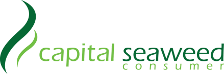

<!-- Slide number: 1 -->
| STT | MÃ SP | TÊN SẢN PHẨM | XUẤT XỨ | QUY CÁCH |
| --- | --- | --- | --- | --- |
| 04 | Albm02 | Ildong Yungmo Albumin (Gold) | Ildong Pharma - Korea | 15ml x 15 chai / hộp |
Tài liệu khoa học
www.csc-vietnam.vn

ĐỐI TƯỢNG SỬ DỤNG:
CÔNG DỤNG:
Người lớn tuổi, cơ thể suy yếu, đi lại khó khăn.
Người bị viêm khớp, đau nhức xương khớp.
Người sau phẫu thuật cần phục hồi vết thương nhanh.
Người bị bệnh gan mạn tính, viêm gan khiến cơ thể giảm khả năng sản xuất Albumin.
Người gặp tình trạng Albumin thấp do rối loạn chuyển hóa hoặc mất cân bằng dinh dưỡng.
Người thường xuyên mệt mỏi, căng thẳng, thiếu dinh dưỡng, uống rượu nhiều.
Người có hệ miễn dịch yếu, hay ốm vặt, nhiễm trùng, hồi phục chậm sau ốm, phẫu thuật, hoặc sau khi ngủ mê, hôn mê.
Người làm việc căng thẳng (nhân viên văn phòng, học sinh, sinh viên...) dễ mệt mỏi, stress.
Người gầy yếu, suy kiệt do bệnh lý mạn tính hoặc suy dinh dưỡng.
Người cần tăng sức đề kháng, bổ sung dưỡng chất trong và sau quá trình điều trị bệnh.
Thúc đẩy tái tạo Collagen, Hyaluronic axit và Elastin.
Giúp cơ thể đào thài độc tố.
Tăng cường miễn dịch, nâng cao đề kháng.
Hỗ trợ ngăn ngừa các bệnh mãn tính.
Cải thiện chức năng gan.
Phục hồi mệt mỏi mãn tính và hôn mê.
Bổ sung sự thiếu hụt Albumin trong hạ Albumin huyết.
HƯỚNG DẪN SỬ DỤNG:
Đối với người trưởng thành bình thường: Dùng đều đặn mỗi ngày 1 chai 15ml.
Đối với người bị thiếu hụt albumin: Dùng đều đặn mỗi ngày 2 chai 15ml, tổng cộng 30ml.
Không chia nhỏ liều uống. Sau khi mở nắp, nên dùng hết 1 chai (15ml) trong một lần.
Trường hợp bảo quản lạnh, nên ngâm chai vào nước ấm khoảng 40–50°C trong 2–3 phút để làm ấm nhẹ, sau đó lắc đều rồi dùng ngay.

15 mL x 15 chai
TĂNG CƯỜNG SỨC KHỎE TỔNG THỂ!
| GIÁ BÁN (đã có 8% VAT) ĐVT: VNĐ |  |  |  |
| --- | --- | --- | --- |
| Số lượng/lần mua | 1 hộp | 5 hộp | 10 hộp |
| Thành tiền | 750.000 | 3.250.000 | 4.800.000 |

<!-- Slide number: 2 -->

Peptit tơ chiết xuất từ kén
Bột albumin lòng trắng trứng
Chiết xuất nhau thai heo
Collagen cá và Axit amin

Sản xuất tại Hàn Quốc
ILDONG PLUS PHARM CO., LTD.
6, 48-Gil, Eongseoseo-ro, Dalseo-gu, Daegu, Korea.

OEM & Nhập khẩu
VIETNAM CAPITAL SEAWEED CONSUMER JSC.
Số 5, Đường CN13, Nhóm CN1, KCN Tân Bình,
P. Sơn Kỳ, Q. Tân Phú, Tp. HCM, Việt Nam.

<!-- Slide number: 3 -->
# Albumin là gì?
Albumin là một loại protein trong huyết tương và được tổng hợp tại gan. Đây là loại protein đóng vai trò quan trọng trong việc ngăn cản chất lỏng trong lòng mạch máu bị rò rỉ ra ngoài, duy trì áp lực thẩm thấu keo luôn ở mức ổn định và cũng là cầu nối để liên kết và vận chuyển các axit béo, hormone, vitamin và các loại thuốc đi đến các cơ quan trong cơ thể.
Tùy thuộc vào độ tuổi, cơ thể chúng ta cần từ khoảng 3.5 - 5.9 g/dl.

Các nguyên nhân phổ biến làm giảm Albumin là gì?
Thường liên quan đến các bệnh xơ gan, tiểu đường, cường giáp, thiếu hụt vitamin, suy dinh dưỡng và sau phẫu thuật, tiêm truyền/ truyền dịch qua đường tĩnh mạch (IV) trong thời gian dài, bị bỏng nghiêm trọng, tình trạng bệnh lý tim mạch, lupus ban đỏ, hội chứng thận hư, nhiễm trùng huyết….

<!-- Slide number: 4 -->

# Ảnh	hưởng	của	việc	thiếu	hụt Albumin đối với cơ thể là gì?
Thiếu hụt Albumin sẽ gây ra các tình trạng trên cơ thể như: Phù nề (tích tụ chất lỏng) ở tay, chân hoặc mặt,  da  thô  ráp  hoặc  khô  hơn  bình  thường,  tóc mỏng, vàng da, khó thở, cảm thấy dễ suy yếu hoặc kiệt sức, nhịp tim không đều, tăng cân bất thường, chán ăn, tiêu chảy, chóng mặt, nôn mửa....
Thiếu hụt Albumin sẽ khiến thời gian hồi phục vết thương (nhất là sau phẫu thuật) kéo dài hơn, giảm đáp ứng thuốc đối với cơ thể (trong trường hợp đang sử dụng thuốc điều trị bệnh), đồng thời tăng nguy cơ phát triển các bệnh lý khác như: Viêm phổi, tràn dịch màng phổi, cổ trướng, teo cơ…

<!-- Slide number: 5 -->

# Điểm khác biệt của Albumin Drinking so với các sản phẩm Albumin khác?
Do có sự khác biệt quan trọng với sản phẩm Albumin dịch truyền (Tiêm tĩnh mạch) và Albumin Drinking (Uống trực tiếp) mà chúng tôi thiết kế ở đây đó là:
Albumin dịch truyền (tiêm tĩnh mạch) là sử dụng Albumin của người được phân lập từ máu tĩnh mạch (huyết tương) nên có rất nhiều tác dụng phụ. Đó là lý do tại sao bằng công nghệ sinh học từ các nhà nghiên cứu và bác sĩ chuyên sâu của chúng tôi cho ra đời một sản phẩm Albumin an toàn sử dụng và không có tác dụng phụ.
Albumin Drinking (uống trực tiếp) của chúng tôi sử dụng Ovoalbumin được sản xuất từ lòng trắng trứng và kết hợp với các thành phần vượt trội (Peptit tơ chiết xuất từ kén, chiết xuất nhau thai heo, collagen cá và các axit amin, đó chính là điểm vượt trội mà mọi người có thể sử dụng sản phẩm thường xuyên hàng ngày giúp bồi bổ cơ thể tăng cường sức khỏe tổng thể và ngăn ngừa các bệnh tật.
Vai trò của các thành phần bổ sung:
Các peptit tơ được chiết xuất từ kén, có tác dụng trong việc hồi phục tế bào bị tổn thương, đặc biệt là tế bào da. Ngoài
ra, thành phần này chứa các axit amin hỗ trợ cho việc thúc đẩy tái tạo collagen và elastin.
Chiết xuất nhau thai heo giúp bổ sung các hormone tăng trưởng, nucleic axit và các chất chống oxy hóa, collagen với
tác dụng bảo vệ tế bào hạn chế bị lão hóa cũng như hỗ trợ quá trình tái tạo và tăng trưởng của tế bào.
Collagen cá hay còn được gọi là collagen thủy phân có cấu trúc giúp dễ hấp thụ gấp nhiều lần so với loại collagen thông thường, giúp cải thiện độ ẩm và độ đàn hồi của da, bổ sung collagen cho xương, sụn và cung cấp chất sừng cho móng và tóc được chắc khỏe.

<!-- Slide number: 6 -->
# FAQ
Sản phẩm Albumin Drinking này được sản xuất tại đâu?
Sản phẩm Albumin Drinking này được sản xuất tại Hàn Quốc và được nhập khẩu chính ngạch bởi
CSC Việt Nam.

Các đối tượng cần lưu ý khi sử dụng sản phẩm là ai?
Đối với phụ nữ có thai và cho con bú, những người bị dị ứng hoặc cơ địa cụ thể, vui lòng kiểm tra
thành phần trước khi dùng.
Có thể xuất hiện kết tủa nhưng đây là một thành phần của nguyên liệu thô nên tuyệt đối an toàn, vì vậy hãy lắc đều chai trước khi sử dụng.
Vui lòng sử dụng ngay sau khi mở nắp.

Làm cách nào để biết chính xác cơ thể đang thiếu hụt Albumin?
Cách tốt nhất để xác định rõ cơ thể đang thiếu hụt Albumin đó là đến gặp bác sĩ và tiến hành xét nghiệm máu để biết chính xác về chỉ số Albumin trong cơ thể.

03

<!-- Slide number: 7 -->
# FAQ
04	Độ tuổi có thể sử dụng Albumin là bao nhiêu?
Người ở độ tuổi nào cũng có thể sử dụng Albumin. Tuy nhiên, cần chú ý đến liều lượng bổ sung
Albumin cần thiết cho cơ thể theo độ tuổi để sử dụng phù hợp.

Albumin có thể sử dụng kết hợp với các loại thực phẩm chức năng (thực phẩm bổ sung) khác hay không?
Có thể, vì công dụng chính của Albumin là khả năng vận chuyển các hợp chất phân tử, bao gồm các thành phần của thuốc. Vì vậy việc sử dụng sản phẩm Albumin có thể giúp hỗ trợ cho các thành phần của thực phẩm chức năng.
05
Tôi có nên bổ sung Albumin Drinking hàng ngày được không?
Albumin có thể được bổ sung thông qua chế độ ăn uống hàng ngày tuy nhiên liều lượng được cơ thể hấp thụ hoàn toàn sẽ không nhiều, do đó việc sử dụng sản phẩm Albumin Drinking hàng ngày giúp hấp thu hoàn toàn lượng Albumin cần thiết cho cơ thể.

06

<!-- Slide number: 8 -->
# FAQ
Sử dụng Albumin Drinking có gây ra các phản ứng phụ nào cho cơ thể không?
Albumin Drinking là một sản phẩm rất an toàn đối với người dùng trừ trường hợp bạn có tiền sử dị ứng với các thành phần của sản phẩm.

Người tập thể dục thể thao cường độ cao hàng ngày có thể sử dụng được Albumin Drinking không?
Albumin Drinking có công dụng giúp tăng cường năng lượng, đồng thời giúp bổ sung chất đạm cho cơ
bắp nên rất phù hợp cho những người thường xuyên tập thể dục thể thao.
07

08

Cách bổ sung Albumin Drinking khoa học nhất cho những người có bệnh mãn tính (Ví dụ: bệnh gan) là như thế nào?
Bệnh nhân sẽ tùy vào loại bệnh mãn tính mắc phải. Nếu người bệnh mắc phải bệnh gan mãn tính thì tình trạng thiếu hụt Albumin sẽ xảy ra. Đối với những người bị thiếu hụt Albumin thì cần bổ sung 2 chai Albumin Drinking mỗi ngày, trước ăn một tiếng.
09

<!-- Slide number: 9 -->
# FAQ

Sử dụng Albumin Drinking này có ảnh hưởng đến người đang mắc bệnh Gout không?
Bệnh Gout xảy ra là vì hàm lượng Acid uric trong cơ thể bị tích tụ và tăng cao đột biến do Purine. Purine là một loại protein có khả năng tổng hợp Axit uric trong máu và thường được tìm thấy ở các loại thịt đỏ.
Vì vậy, việc sử dụng Albumin Drinking sẽ không gây ảnh hưởng gì đến bệnh gout.
10

<!-- Slide number: 10 -->

