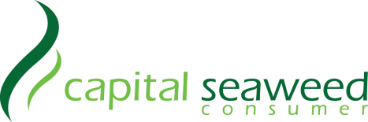

<!-- Slide number: 1 -->
| STT | MÃ SP | TÊN SẢN PHẨM | XUẤT XỨ | QUY CÁCH |
| --- | --- | --- | --- | --- |
| 02 | Immilk01 | TPBS ProImmilk | Cosfarm - Korea | 20g x 15 gói / hộp |
Tài liệu khoa học
www.csc-vietnam.vn

CÔNG DỤNG:
ĐỐI TƯỢNG SỬ DỤNG:
Trẻ từ 3 tuổi trở lên và người lớn ở mọi độ tuổi.
Người muốn tăng cường sức khỏe mỗi ngày, nâng cao sức đề kháng.
Người suy dinh dưỡng, hay mệt mỏi, dễ bị ốm khi thay đổi thời tiết.
Người vừa ốm dậy, sau điều trị bệnh, cần phục hồi nhanh và bổ sung dinh dưỡng.
Người gặp vấn đề về tiêu hóa, kém hấp thu, rối loạn tiêu hóa.
Người mắc bệnh lý nền, cần hỗ trợ dinh dưỡng hằng ngày như:
Bệnh nhân ung thư
Bệnh nhân tiểu đường
Người bị tim mạch, huyết áp
Người mắc bệnh về xương khớp
Người có bệnh liên quan đến hệ miễn dịch

Cân bằng miễn dịch.
Chống oxy hóa cao.
Giảm các triệu chứng về viêm khớp.
Ngăn ngừa ung thư.
Tăng cường chức năng não bộ.
Tăng cường hỗ trợ tiêu hóa.
Cải thiện sức khỏe tim mạch.
Kháng khuẩn, kháng viêm.
Giảm tác dụng phụ sau quá trình điều trị Ung thư như hóa trị, xạ trị…
Bổ sung các chất dinh dưỡng và khoáng chất thiết yếu mà cơ thể không tự tổng hợp được.
HƯỚNG DẪN SỬ DỤNG:
Trẻ em từ 3 tuổi - người trưởng thành: một ngày sử dụng từ 1 - 2 gói (20g/gói).
Người đang bệnh hoặc cần bồi bổ sức khỏe: một ngày sử dụng từ 2 - 3 gói (20g/gói).
CÁCH PHA:
Pha một gói ProImmilk 20g với 100 - 120ml nước ấm, khuấy đều cho đến khi hòa tan hoàn toàn và thưởng thức ngay.
Có thể pha chung với nước sinh tố hoặc các loại sữa khác nếu có nhu cầu (sữa bột, ngũ cốc, các loại sữa hạt...)
SỮA KHÁNG THỂ
Điều tiết cân bằng nội môi,
cân bằng hệ miễn dịch
| GIÁ BÁN (đã có 8% VAT) ĐVT: VNĐ |  |  |  |
| --- | --- | --- | --- |
| Số lượng/lần mua | 1 hộp | 5 hộp | 10 hộp |
| Thành tiền | 950.000 | 3.750.000 | 5.750.000 |

### Notes:

<!-- Slide number: 2 -->
# ProImmilk là gì?
Prolmmilk là thực phẩm bổ sung kháng thể được thiết kế với mục tiêu kích hoạt và điều tiết hệ miễn dịch ở người, qua đó hỗ trợ cơ thể tăng cường sức đề kháng trước nguy cơ dịch bệnh.
Prolmmilk hỗ trợ bảo vệ sức khỏe thông qua những thành phần quan trọng bao gồm: Bột sữa colostrum, beta-glucan chiết xuất từ nấm Shiitake lên men, lợi khuẩn Axit lactic nhiệt hóa EF-2001, hợp chất Kẽm gluconat và tổ hợp Vitamin D3.

<!-- Slide number: 3 -->
# Thành phần có trong ProImmilk

<!-- Slide number: 4 -->

Bột sữa Colostrum chiết xuất từ sữa non chứa hơn 90 thành phần hoạt tính sinh học bao gồm lactoferrin, 5 loại globulin miễn dịch (IgA, IgD, IgM, IgG, IgE), các yếu tố tăng trưởng, hormone, vitamin, khoáng chất cùng với hàm lượng chất béo thấp, giúp dễ  dàng hấp  thu hơn các loại sữa thông thường, rất cần thiết cho các hoạt động tối ưu của hệ miễn dịch và hỗ trợ phòng chống bệnh hiệu quả.

Tổ  hợp  Vitamin  D3  là  một  trong  số những vitamin rất cần thiết cho cơ thể, có chức năng tăng cường mật độ xương, cải thiện hệ thống miễn dịch cho cơ thể, giảm huyết áp, giảm nguy cơ đột quỵ và đau tim.

β - glucan được chiết xuất từ nấm Shiitake lên men là một loại chất xơ có tiềm năng lớn trong việc hỗ trợ cơ thể nhờ vào cấu trúc polysaccharide được tạo thành từ chuỗi liên kết các glucose. Từ đó, β - glucan có vai trò như là một chất chống oxy hóa cũng như là hợp chất cơ chế điều chỉnh đáp ứng sinh học giúp bồi bổ sức khỏe. Ngoài ra, chiết xuất nấm Shiitake lên men còn chứa tổ hợp các vitamin nhóm B: Vitamin B3, vitamin B5, vitamin B6, vitamin B9, vitamin B12.

Galacto  -  oligosaccharide  (GOS) Prebiotic Galacto - oligosaccharide (GOS) sẽ là nguồn dinh dưỡng hoàn hảo giúp cho các lợi khuẩn có trong hệ thống tiêu hóa của cơ thể hoạt động hiệu quả hơn đồng thời kiềm hãm sự phát triển của các vi sinh vật có hại.

Hợp  chất  kẽm  Gluconat  là một loại khoáng vi lượng rất quan trọng cần được bổ sung vào chế độ dinh dưỡng hàng ngày do cơ thể chúng ta không thể tự tổng hợp được. Kẽm đóng vai trò thiết yếu trong việc kháng viêm, tăng cường hệ miễn dịch và tăng tốc độ hồi phục vết thương.
Lợi khuẩn axit lactic nhiệt hóa EF - 2001 Enterococcus  Faecalis  2001  (EF  -  2001)  là  lợi khuẩn hỗ trợ cho đường ruột. Sau khi được nhiệt hóa, EF - 2001 được tăng cường khả năng điều chỉnh phản ứng sinh học giúp điều tiết hệ thống tiêu hóa được hoạt động hiệu quả hơn. EF - 2001 nhiệt hóa đã được chứng minh hỗ trợ cơ thể tốt hơn so với các loại lợi khuẩn sống và hạn chế được nhiều tác dụng phụ.

<!-- Slide number: 5 -->

# ProImmilk có thể hỗ trợ điều trị ung thư như thế nào?
Hầu hết các thành phần trong ProImmilk đều có cơ chế điều chỉnh đáp ứng sinh học. Đây là một cơ chế khá quan trọng của hệ miễn dịch để hỗ trợ điều trị ung thư, giúp cho hệ thống miễn dịch của người bệnh được tăng cường để dễ dàng nhận biết và liên kết với tế bào ung thư, kích hoạt các tín hiệu trên tế bào gây hại này để các tế bào miễn dịch có chức năng tiêu diệt có thể phá hủy tế bào ung thư.

<!-- Slide number: 6 -->
# ProImmilk có thể hỗ trợ điều trị ung thư như thế nào?

Bột sữa Colostrum: Chứa hơn 90 thành phần hoạt tính sinh học, bao gồm các yếu tố miễn dịch và phát triển, enzyme, kháng thể và những chất dinh dưỡng quan trọng cho sự hoạt động tối ưu của cơ thể và hỗ trợ phòng chống bệnh.
1

Lợi khuẩn EF-2001: Tăng cường chức năng tiêu hóa giúp cơ thể duy trì cân bằng nội môi và cân bằng
miễn dịch. Qua đó hạn chế các bệnh viêm nhiễm, chống lại sự hình thành và phát triển của các tế bào khối u.
2

Beta-glucan: Kiểm soát và điều tiết các phản ứng miễn dịch để bảo vệ cơ thể đối với tác động của chứng dị ứng và bệnh tự miễn, bên cạnh đó kiểm soát các gốc tự do để ngăn ngừa sự oxy hoá và làm chậm quá trình lão hoá của tế bào.
3

Galacto-oligosaccharides (GOS): Duy trì sự cân bằng của hệ khuẩn trong đường ruột, qua đó đảm bảo hệ miễn dịch đường ruột đủ khả năng để chống lại các tác nhân gây bệnh.
4

Chiết xuất nấm Shiitake lên men: Có chứa khoáng chất đồng tự nhiên cần thiết cho sự hình thành và hoạt động của các mạch máu, xương khớp, kiểm soát cholesterol trong máu, tăng cường sản sinh tế bào bạch cầu để chống lại vi khuẩn xấu và các bệnh viêm nhiễm.
5

Hợp chất kẽm Gluconat và tổ hợp Vitamin D3: Khoáng vi lượng và vitamin là những thành phần
rất quan trọng cho sự vận hành của hệ miễn dịch ở cơ thể người.
6

<!-- Slide number: 7 -->
# FAQ
01
Sữa ProImmilk được sản xuất ở đâu?
Sữa ProImmilk được hợp tác và nghiên cứu giữa CSC Việt Nam và Ceul Corp., Korea và sản xuất
tại Hàn Quốc.
02
Sữa kháng thể ProImmilk có giấy chứng nhận kèm theo hay không?
ProImmilk đã được cấp giấy công bố sản phẩm và giấy kết quả kiểm nghiệm sản phẩm. HACCP, GMP, FDA, Health Certificate, Free sale, Giấy chứng nhận An toàn Thực phẩm của Bộ Y Tế Việt Nam.
03
Những lưu ý khi sử dụng ProImmilk
Nếu có vấn đề về tăng can-xi máu hoặc đang dùng các loại thuốc bổ sung thì nên tham khảo ý kiến
bác sĩ trước khi sử dụng.
04
Cách bảo quản sản phẩm
Sản phẩm cần được bảo quản ở nơi khô ráo, thoáng mát. Tránh ánh nắng trực tiếp và nhiệt độ cao.

<!-- Slide number: 8 -->
# FAQ
05
Tại sao ProImmilk lại được gọi là sữa kháng thể?
Do sữa ProImmilk được bổ sung kháng thể chiết xuất từ sữa non (colostrum milk), chứa hơn 90 thành phần hoạt tính sinh học, bao gồm các yếu tố miễn dịch, enzyme và kháng thể, những chất dinh dưỡng quan trọng cho sự hoạt động tối ưu của cơ thể và hỗ trợ phòng chống bệnh tật.
06
Trẻ em khi sử dụng sữa kháng thể có xảy ra tình trạng tiêu chảy hay không?
ProImmilk là loại sữa kháng thể được thiết kế cho trẻ em từ 3 tuổi trở lên. Việc sử dụng thường xuyên sẽ giúp hỗ trợ đường tiêu hóa khỏe mạnh cho trẻ em, phòng ngừa rối loạn tiêu hóa.
07
Người già bị tiểu đường, tim mạch, huyết áp và các bệnh mãn tính có thể sử dụng sữa ProImmilk được không?
Các đối tượng trên đều được khuyến cáo sử dụng. Sử dụng hàng ngày sẽ tốt cho sức khỏe, ngăn
ngừa bệnh tật, làm chậm quá trình lão hóa và tăng cường trí nhớ…

<!-- Slide number: 9 -->
# FAQ
08
Sữa kháng thể ProImmilk khi sử dụng có gây tác dụng phụ nào không?
ProImmilk hầu hết sẽ không gây tác dụng phụ.
Chú ý: Các đối tượng nếu bị dị ứng với bất kỳ thành phần nào trong sữa ProImmilk nên tham khảo ý
kiến chuyên gia dinh dưỡng hoặc bác sĩ trước khi sử dụng.
09
Phụ nữ có thai có thể sử dụng sữa kháng thể ProImmilk hay không?
Phụ nữ có thai vẫn có thể sử dụng sữa kháng thể ProImmilk để bồi bổ sức khỏe tổng thể.
10
Người bị dị ứng với sữa bò có thể uống được ProImmilk hay không?
Người bị dị ứng với sữa bò thường là do dị ứng với 2 loại protein casein và whey trong sữa. Thông
thường, có người sẽ dị ứng với 1 trong 2 loại này, cũng có người bị dị ứng với cả 2 loại.
ProImmilk không chứa casein nhưng có chứa whey, nên người bị dị ứng sữa bò cần xác định chính xác cơ thể mình bị dị ứng với thành phần nào trong sữa. Nếu người bị dị ứng sữa do whey thì không nên sử dụng ProImmilk.

<!-- Slide number: 10 -->
# Sữa ProImmilk khác với các loại sữa khác trên thị trường như thế nào?
ProImmlik là một loại sữa kháng thể thế hệ mới dựa trên công nghệ sinh học phân tử - tế bào và thông qua cơ chế điều chỉnh đáp ứng sinh học (Biological Response Modifier = BRMs). Nhằm tăng cường sức khỏe tổng thể, cân bằng nội môi và miễn dịch, làm chậm quá trình lão hóa, sản phẩm ProImmilk được thiết kế dựa trên các kết quả lâm sàng tại Nhật Bản và Hàn Quốc cho một sản phẩm dinh dưỡng cao cấp, tối ưu hóa sự hấp thu và đạt được hiệu quả cao nhất với các đối tượng suy nhược cơ thể, miễn dịch suy giảm, người mắc các bệnh tự miễn, đặc biệt là các đối tượng như ung thư, tim mạch, tiểu đường, các bệnh truyền nhiễm do virus corona gây ra trong đại dịch hiện nay có thể sử dụng trước, trong và sau điều trị, dùng thường xuyên hàng ngày sẽ nâng cao chất lượng sức khỏe và không có bất kỳ tác dụng phụ không mong muốn nào, chi phí hợp lý với mọi người tiêu dùng Việt Nam hiện tại.
Sự ra đời sản phẩm ProImmilk này là cả một quá trình nghiên cứu công phu và thử nghiệm nghiêm túc trong một thời gian dài đã đạt kết quả báo cáo vượt trội so với các sản phẩm hiện nay trên thị trường, với công thức có chứa các thành phần quan trọng như:
Bột sữa Colostrum giàu hàm lượng IgI, IgG, IgA,..., lactoferrin.
Beta-glucan chiết xuất từ nấm Shiitake lên men.
Lợi khuẩn nhiệt hóa EF-2001.
Galacto-oligosaccharide.
Kẽm Gluconat.
Tổ hợp Vitamin D3.
Đây là các thành phần mà các loại sữa khác trên thị trường không có.

<!-- Slide number: 11 -->

